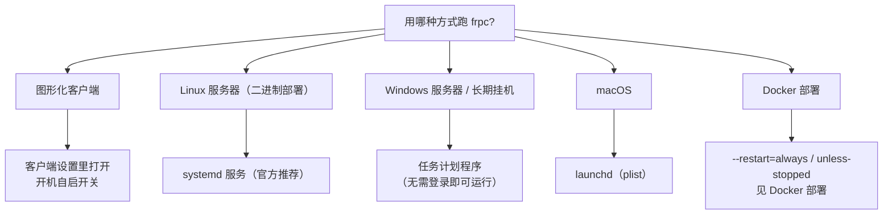

# 开机自启

让 frpc / 客户端在机器开机后自动运行，并在进程异常退出后自动恢复。

::: tip 💡 先想清楚有没有必要
- **服务器、NAS、7×24 在线的机器：有必要**。没人盯着屏幕，重启后不自动拉起，隧道就长期掉线。
- **个人电脑、用时才开：没必要折腾**。图形客户端自带开机自启开关，或者用时手动启动即可。
:::

## 方式选择



## 图形化客户端

LingYunFrp 图形客户端的设置界面中通常提供「开机自启 / 开机启动」开关，勾选即可，不需要手工配置系统服务。具体位置以客户端当前版本的设置界面为准。

- **用处**：登录系统后自动拉起客户端，最省心；
- **有没有必要**：桌面用户只建议用这种方式，不要在系统里再重复注册一个 frpc 服务，否则会出现**两个 frpc 同时在线抢同一条隧道**，导致隧道反复上下线（`proxy already exists`）。

## Linux：systemd（官方推荐方式）

frp 官方文档明确建议长期运行时配合 **systemd**（或 supervisor）使用。主流 Linux 发行版（Ubuntu 16.04+、Debian 9+、CentOS 7+）都自带 systemd，无需额外安装。

### 1. 准备文件

假设二进制放在 `/usr/local/bin/frpc`，配置放在 `/etc/frp/frpc.toml`（路径不同请自行替换）：

```bash
sudo mkdir -p /etc/frp
# 把面板生成的配置写入 /etc/frp/frpc.toml
sudo cp frpc /usr/local/bin/
```

### 2. 创建服务单元

新建 `/etc/systemd/system/frpc.service`：

```ini
[Unit]
Description=frp client
After=network-online.target
Wants=network-online.target

[Service]
Type=simple
ExecStart=/usr/local/bin/frpc -c /etc/frp/frpc.toml
Restart=always
RestartSec=5
LimitNOFILE=1048576

[Install]
WantedBy=multi-user.target
```

每一项的含义，以及**为什么这样写**：

| 配置 | 用处 | 有没有必要 |
| --- | --- | --- |
| `After=network-online.target` + `Wants=network-online.target` | 等网络真正就绪后再启动 frpc，避免开机瞬间网络没起来导致首轮登录失败 | **建议保留**。用 `network.target` 只代表网络栈初始化，不代表能上网 |
| `Type=simple` | systemd 认为 ExecStart 启动的进程就是主服务 | frpc 是前台常驻进程，必须 simple；不能写 forking |
| `Restart=always` | 无论 frpc 因什么原因退出（崩溃、被杀、配置错误），5 秒后自动重启 | **核心配置**。这是「进程守护」，与 frpc 内置的网络重连互补 |
| `RestartSec=5` | 退出后等 5 秒再拉起 | 建议保留，避免断网/故障时空转刷屏 |
| `LimitNOFILE=1048576` | 提高进程可打开的文件描述符上限（每条连接都占一个） | 隧道多、连接多时才必要；单条隧道可省略 |
| `WantedBy=multi-user.target` | 挂到多用户运行级别，`enable` 后即开机自启 | **开机自启的关键行**，不能少 |

### 3. 启用并启动

```bash
sudo systemctl daemon-reload     # 新建/修改 service 文件后必须执行
sudo systemctl enable --now frpc # enable=开机自启，--now=同时立刻启动
```

### 4. 日常管理

```bash
systemctl status frpc            # 查看运行状态（active running 为正常）
sudo systemctl restart frpc      # 改完配置后重启使其生效
sudo systemctl stop frpc         # 停止
journalctl -u frpc -f            # 实时跟踪日志（见日志查看）
journalctl -u frpc --since "1 hour ago"   # 看最近一小时日志
```

## Windows：任务计划程序

Windows 上推荐用系统自带的**任务计划程序**实现「开机即运行、无需登录、无黑窗口」，不需要安装任何第三方软件。

### 配置步骤

1. 打开「任务计划程序」（`taskschd.msc`），右侧点击「创建任务」（不是「创建基本任务」）；
2. **常规** 选项卡：
   - 名称填 `frpc`；
   - 勾选「不管用户是否登录都要运行」（这样开机后没人登录也会启动）；
   - 勾选「使用最高权限运行」；
3. **触发器** → 新建：开始任务选「启动时」（机器开机就跑）；若只想在自己登录后跑，可选「登录时」；
4. **操作** → 新建：
   - 操作：启动程序；
   - 程序或脚本：填 `frpc.exe` 的完整路径，如 `C:\frp\frpc.exe`；
   - 添加参数：`-c C:\frp\frpc.toml`；
5. **条件** 选项卡：取消「只有在计算机使用交流电源时才启动此任务」（笔记本/断电场景需要）；
6. 保存后右键任务 →「运行」立即测试。

**用处与必要性**：

- 「不管用户是否登录都运行」是关键——这决定了它是**开机自启（boot）**而不是**登录后自启（logon）**。服务器、挂机电脑必须选它；
- 个人电脑若能接受「登录后才启动」，更简单的做法是按 `Win + R` 输入 `shell:startup` 打开启动文件夹，把 `frpc` 的快捷方式放进去，但这种方式会**一直留着一个控制台窗口**，关掉窗口等于停掉 frpc。

### 备选：NSSM（第三方）

也可以用 [NSSM](https://nssm.cc/)（Non-Sucking Service Manager）把 frpc 注册成真正的 Windows 服务（`nssm install frpc`，在图形界面里指定程序和参数即可）。它是社区广泛使用的免费工具，但属于**第三方软件**；没有特殊需求时，任务计划程序已足够，不必额外安装。

## macOS：launchd

macOS 的系统服务管理器是 launchd，通过 plist 文件定义服务。个人 Mac 建议用 **LaunchAgent（登录后启动）**，放在自己的用户目录即可，不需要 sudo。

### 1. 创建 plist

创建 `~/Library/LaunchAgents/com.lingyunfrp.frpc.plist`（注意 Intel 与 Apple 芯片 Homebrew/二进制路径不同，按实际路径填写）：

```xml
<?xml version="1.0" encoding="UTF-8"?>
<!DOCTYPE plist PUBLIC "-//Apple//DTD PLIST 1.0//EN" "http://www.apple.com/DTDs/PropertyList-1.0.dtd">
<plist version="1.0">
<dict>
    <key>Label</key>
    <string>com.lingyunfrp.frpc</string>
    <key>ProgramArguments</key>
    <array>
        <string>/usr/local/bin/frpc</string>
        <string>-c</string>
        <string>/etc/frp/frpc.toml</string>
    </array>
    <key>RunAtLoad</key>
    <true/>
    <key>KeepAlive</key>
    <true/>
    <key>StandardOutPath</key>
    <string>/tmp/frpc.log</string>
    <key>StandardErrorPath</key>
    <string>/tmp/frpc.err.log</string>
</dict>
</plist>
```

关键字段：

| 字段 | 用处 |
| --- | --- |
| `RunAtLoad` | 加载时立即启动（登录后自动运行） |
| `KeepAlive` | 进程退出后自动重新拉起（等同 systemd 的 `Restart=always`） |
| `StandardOutPath` / `StandardErrorPath` | 把控制台输出落到文件，否则 Mac 上没有地方看日志 |

### 2. 加载与管理

```bash
launchctl load ~/Library/LaunchAgents/com.lingyunfrp.frpc.plist    # 启用
launchctl unload ~/Library/LaunchAgents/com.lingyunfrp.frpc.plist  # 停用
launchctl list | grep frpc                                         # 确认已加载
```

- 若要**开机就运行（无需登录）**，plist 需放到 `/Library/LaunchDaemons/` 且属主为 `root:wheel`，配置不当会影响系统启动，没有服务器级需求不要用，LaunchAgent 足够；
- Apple 芯片 Mac 若用 Homebrew 安装，frpc 路径通常是 `/opt/homebrew/bin/frpc`，Intel 机型是 `/usr/local/bin/frpc`，可用 `which frpc` 确认。

## Docker 用户

不需要在系统里再配自启。Docker 自身设置 `--restart=always` 或 `--restart=unless-stopped` 后，Docker 服务开机自启（默认即是），容器就会随系统恢复。详见 [Docker 部署](./docker-deploy)。

## 配置完成后的验证

无论哪种方式，都做两个测试：

1. **重启测试**：重启机器，不登录（或登录后）查看 frpc 是否自动运行，面板上隧道是否自动上线；
2. **杀进程测试**：手动结束 frpc 进程，等待约 5 秒，确认它被自动拉起（systemd 看 `systemctl status`，任务计划看任务上次运行结果，Docker 看 `docker ps`）。

两条都通过，才算真正具备「无人值守」能力。

## 常见误区

| 误区 | 正确理解 |
| --- | --- |
| 配了开机自启就不会掉线 | 自启只管「开机/崩溃后恢复」；网络闪断靠 frpc 内置重连；节点故障两者都救不了 |
| 图形客户端和 frpc 服务可以同时跑 | 同一账号同一隧道只能有一个 frpc 在线，重复运行会互相挤掉 |
| 改完 frpc.toml 就生效 | 不会，需要 `systemctl restart frpc` / 重启容器 / 重启计划任务 |
| 忘记确认实际路径 | 服务文件里的二进制路径、配置路径必须与实际完全一致，否则服务启动即退出 |
