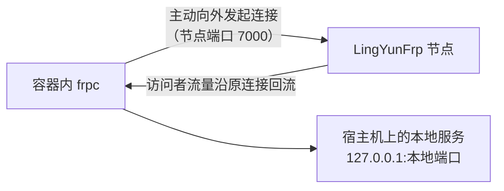

# Docker 部署

可以用 Docker 运行 frpc。本页只讲**客户端 frpc 的容器化**——LingYunFrp 的节点（frps）由平台维护，你不需要部署服务端。

## 有没有必要用 Docker？

::: tip 💡 先判断适不适合你
- **适合**：已有 Docker 环境的 Linux 服务器、NAS（群晖、威联通、Unraid 等）、树莓派；希望和其他容器统一管理、不想手动放二进制；
- **不适合**：Windows / macOS 桌面机——直接用图形客户端或下载二进制运行更简单，为 frpc 单独装 Docker 反而更重；
- **结论**：Docker 只是 frpc 的另一种「打包运行方式」，功能与直接运行二进制完全一样，没有额外加成，已经在用 Docker 再考虑它。
:::

## 镜像说明（重要，避免拉错）

- frp 官方项目**没有发布官方 Docker 镜像**。frp 官方文档对长期运行的推荐方式是 systemd / supervisor（见[开机自启](./auto-start)）；
- 社区中使用最广泛的是 [`snowdreamtech/frpc`](https://hub.docker.com/r/snowdreamtech/frpc)（对应服务端为 `snowdreamtech/frps`），镜像 tag 跟随 frp 官方版本号发布（如 `snowdreamtech/frpc:0.61.1`）；
- 镜像提供 amd64、arm64 等多架构变体，`docker pull` 时自动匹配当前机器架构，x86 服务器和 ARM 架构 NAS / 开发板通用（不确定时可在镜像 Tags 页面确认）。

::: warning ⚠️ tag 必须与节点要求的主版本一致
不要直接用 `latest`。节点要求 frpc 0.61.x，就用 `:0.61.1` 这类具体版本 tag。版本匹配规则见[配置文件说明 · 版本匹配](../parameters/config-file)。
:::

## 准备配置文件

配置仍然是从 LingYunFrp 面板获取的那份 `frpc.toml`，内容与 Docker 无关，写法见[快速开始](../quick-start/)。以放到宿主机 `/etc/frp/frpc.toml` 为例：

```bash
sudo mkdir -p /etc/frp
sudo vi /etc/frp/frpc.toml   # 粘贴面板生成的配置并保存
```

## 方式一：docker run（host 网络，Linux 推荐）

```bash
docker run -d \
  --name frpc \
  --restart=always \
  --network host \
  -v /etc/frp/frpc.toml:/etc/frp/frpc.toml:ro \
  snowdreamtech/frpc:0.61.1
```

逐行解释**为什么这样写**：

| 参数 | 用处 | 有没有必要 |
| --- | --- | --- |
| `-d` | 后台运行 | 常驻部署必加 |
| `--name frpc` | 给容器固定名字，后续 `docker logs frpc`、`docker restart frpc` 才方便 | 建议加 |
| `--restart=always` | 容器退出自动重启；Docker 服务开机自启后容器也自动恢复 | **核心**，它同时承担了「崩溃守护 + 开机自启」，不需要再配 systemd/任务计划 |
| `--network host` | 容器直接使用宿主机网络栈 | **Linux 上推荐**，原因见下文 |
| `-v ...:/etc/frp/frpc.toml:ro` | 把宿主机配置挂进容器内固定路径；镜像默认执行 `frpc -c /etc/frp/frpc.toml` | 必挂。`:ro` 表示容器只读，防止容器内误改配置 |
| `:0.61.1` | 固定版本 tag | 必须与节点主版本匹配，不用 `latest` |

### 为什么用 host 网络，而且不需要 -p 映射端口？



- frpc 是**反向连接**：它只主动向外连节点，不在本地监听任何公网端口，所以**不需要 `-p` 发布端口**（这也是它和一般 Web 容器最大的区别）；
- host 模式下，容器里的 `127.0.0.1` 就是宿主机，配置里的 `localIP = "127.0.0.1"` 能直接访问宿主机上的服务，无需额外网络配置。

## 方式二：docker compose

在任意目录创建 `compose.yaml`（配置文件与它同目录时可写相对路径）：

```yaml
services:
  frpc:
    image: snowdreamtech/frpc:0.61.1
    container_name: frpc
    restart: always
    network_mode: host
    volumes:
      - /etc/frp/frpc.toml:/etc/frp/frpc.toml:ro
```

管理命令（在 compose.yaml 所在目录执行）：

```bash
docker compose up -d      # 创建并后台启动
docker compose ps         # 查看状态
docker compose logs -f    # 跟踪日志
docker compose restart    # 修改配置后重启使其生效
docker compose down       # 停止并删除容器（配置文件在宿主机，不受影响）
```

## 方式三：桥接网络（Docker Desktop / 不想用 host 模式）

Windows、macOS 的 Docker Desktop 对 host 网络支持有限，应使用默认桥接网络。此时容器里的 `127.0.0.1` 指向容器自身，访问**宿主机上**的服务要改用特殊域名 `host.docker.internal`：

```bash
docker run -d \
  --name frpc \
  --restart=unless-stopped \
  --add-host=host.docker.internal:host-gateway \
  -v /etc/frp/frpc.toml:/etc/frp/frpc.toml:ro \
  snowdreamtech/frpc:0.61.1
```

同时把 `frpc.toml` 中访问宿主机服务的那一条改为：

```toml
localIP = "host.docker.internal"
```

说明：

- Docker Desktop（Windows / Mac）内置 `host.docker.internal`，无需 `--add-host`；Linux 上该参数需要 Docker 20.10 及以上版本；
- 如果本地服务在**局域网另一台机器**上（不是宿主机），无论哪种网络模式，`localIP` 都直接填那台机器的局域网 IP（如 `192.168.1.20`），与容器无关；
- stcp 的 visitor 需要在本地绑定端口，host 模式下绑定结果直接出现在宿主机；桥接模式下默认只在容器内可访问，需要额外的端口映射，因此 stcp visitor 更建议用 host 模式或直接运行二进制。

`--restart=unless-stopped` 与 `always` 的区别：两者都会开机自启、崩溃重启；但 `unless-stopped` 下你手动 `docker stop` 的容器，重启 Docker 后不会被拉起。服务器无人值守用 `always` 更省心。

## 验证与日常维护

```bash
docker logs -f frpc          # 看到 login to server success、start proxy success 即正常
docker ps --filter name=frpc # STATUS 应为 Up
```

| 操作 | 做法 |
| --- | --- |
| 修改了 frpc.toml | 保存后执行 `docker restart frpc`（或 `docker compose restart`），frpc 只在启动时读一次配置 |
| 升级 frpc 版本 | 修改镜像 tag 为节点要求的新版本 → `docker compose pull && docker compose up -d`（或 `docker rm -f frpc` 后重新 run） |
| 看日志排查问题 | `docker logs --tail 200 frpc`，日志关键字对照见[日志查看](./log-view)与[故障排查](../parameters/troubleshooting) |
| 查看实际运行版本 | `docker exec frpc frpc -v` |

## 拉取镜像很慢怎么办

国内网络拉 Docker Hub 可能超时。通用做法是在 `/etc/docker/daemon.json` 中配置 `registry-mirrors` 镜像加速后重启 Docker：

```json
{
  "registry-mirrors": ["https://你的加速器地址"]
}
```

公共加速地址经常变动、失效，**具体可用地址以你当前的云服务商 / 网络环境提供的为准**，不要使用来源不明的加速器。NAS（群晖、Unraid 等）可在各自的 Docker 管理界面「注册表 / Registry Mirrors」中做同样配置。

## 与其他部署方式的关系

- Docker 部署后**不要再**用 systemd、开机启动项或图形客户端运行同一个账号的同一条隧道，否则会出现 `proxy already exists`、隧道反复上下线（原因见[开机自启 · 常见误区](./auto-start)）；
- 自启动与崩溃守护已由 `--restart` 策略覆盖，无需任何额外配置；
- 日志已由 Docker 统一收集，不需要在 `frpc.toml` 中再开文件日志，见[日志查看](./log-view)。
