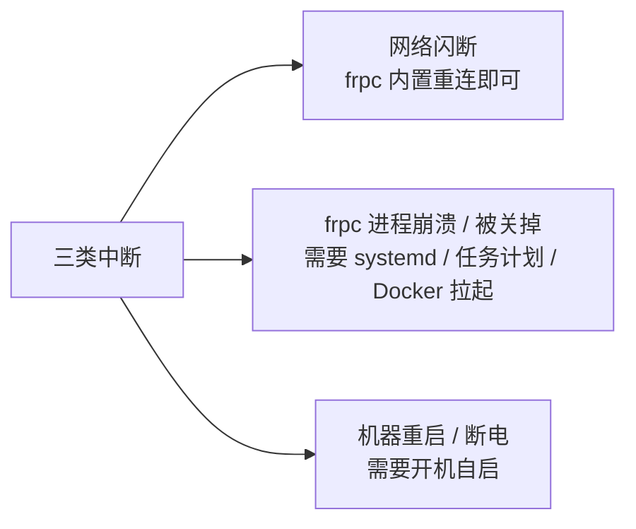

# 进阶使用

隧道跑通之后，本模块解决两个问题：**怎么让它长期稳定在线**（开机自启、Docker、日志），以及**怎么把它调到合适的状态**（性能调优）。

这些操作都不是「必做项」——隧道能正常使用时，什么都不改完全没问题。下面这张表帮你判断每一项**有没有必要做**。

## 各项功能的必要性一览

| 页面 | 解决什么问题 | 什么情况下有必要 | 什么情况下没必要 |
| --- | --- | --- | --- |
| [开机自启](./auto-start) | 机器重启后隧道自动恢复；进程异常退出后自动拉起 | 服务器、NAS、需要 7×24 在线的机器 | 个人电脑临时用、用时手动开即可 |
| [性能调优](./performance) | 加密、压缩、连接池、传输协议等参数的取舍 | 有明确诉求（链路不安全、文本流量想省带宽、丢包网络想加速） | 当前延迟和速度都满意时——默认值就是官方推荐值 |
| [日志查看](./log-view) | 出问题时有据可查 | 隧道偶发掉线、需要定位问题；长期常驻的机器 | 一切正常、纯图形客户端使用时基本不用碰 |
| [Docker 部署](./docker-deploy) | 用容器方式运行 frpc，隔离环境、统一管理 | 已有 Docker 环境的服务器 / NAS（群晖、Unraid 等） | Windows / macOS 桌面机，直接用客户端或二进制更简单 |

## 一个重要前提

frpc 自身已经具备**断线自动重连**能力（配置 `loginFailExit = false` 后登录失败也会持续重试，见[配置文件说明](../parameters/config-file)）。本模块里的「开机自启」「Docker 重启策略」解决的是另外两类它自己管不了的问题：

所以「自启动」和「自动重连」是互补关系，不是重复配置。
