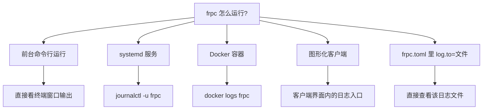

# 日志查看

日志是判断隧道问题的第一手资料。本页说明 frpc 日志怎么配、在哪里看、以及哪些日志行最关键。

::: tip 💡 有没有必要专门配置日志？
- **命令行直接前台运行**：日志直接打印在屏幕上，什么都不用配；
- **systemd / Docker 托管**：系统已经自动收集日志（journald / docker logs），**不需要**再在 frpc.toml 里写文件日志，否则同一份日志存两遍、还占磁盘；
- **裸进程后台运行（nohup 等）**：才有必要用 `log.to` 把日志写到文件；
- **排查疑难问题时**：临时把 `log.level` 调到 `debug`，问题解决后**记得调回 `info`**，debug 日志量很大。
:::

## frpc 的日志配置

在 `frpc.toml` 中配置（默认值见注释）：

```toml
# 日志输出位置：
#   不设置或 "console" → 输出到标准输出（屏幕 / journald / docker logs）
#   文件路径（如 "./frpc.log"）→ 写入文件
log.to = "console"

# 日志级别：trace < debug < info < warn < error，默认 info
log.level = "info"

# 写入文件时，日志保留多少天（按天滚动删除旧日志），默认 0 = 不自动删除
log.maxDays = 3
```

| 级别 | 内容 | 什么时候用 |
| --- | --- | --- |
| `error` | 只有错误 | 日志想保持极度干净时，不建议长期用，会漏掉预警 |
| `warn` | 警告 + 错误 | 生产环境保守选择 |
| `info`（默认） | 连接、隧道上下线等关键事件 | **绝大多数场景用它即可** |
| `debug` | 每条代理、每次连接的详细信息 | 排查问题时临时开启 |
| `trace` | 最详细的协议级信息 | 极少需要，日志量极大 |

## 不同部署方式下在哪里看日志



### 前台运行

直接在终端里就能看到输出。Linux 下想顺手存一份，可以用系统自带的重定向（这不需要改配置）：

```bash
frpc -c ./frpc.toml 2>&1 | tee frpc-$(date +%F).log
```

### systemd（Linux）

```bash
journalctl -u frpc -f                       # 实时滚动跟踪（Ctrl+C 退出）
journalctl -u frpc -n 200 --no-pager        # 最近 200 行
journalctl -u frpc --since "today"          # 今天以来
journalctl -u frpc --since "2026-09-25 09:00" --until "2026-09-25 12:00"
```

### Docker

```bash
docker logs -f frpc                # 实时跟踪
docker logs --tail 200 frpc        # 最近 200 行
docker logs --since 30m frpc       # 最近 30 分钟
```

### 图形化客户端

客户端界面通常提供「日志」标签或隧道详情中的运行日志，具体位置以客户端当前版本界面为准。

### 文件日志

若 `log.to = "/var/log/frpc/frpc.log"`（或 Windows 路径 `./frpc.log`），直接查看该文件即可。注意：

- 目录必须提前存在且 frpc 有写入权限，否则启动时写日志失败；
- 配合 `log.maxDays` 让旧日志自动清理，避免长时间运行把磁盘写满。

## 正常情况下应该看到什么

启动成功时，日志按顺序出现这两个标志（[故障排查](../parameters/troubleshooting)也是按这两个标志分层的）：

```text
... login to server success, get run id ...     # ① 已登录节点
... [隧道名] start proxy success                 # ② 每条隧道注册成功
```

## 需要重点关注的日志行

| 日志关键字（含义） | 说明 | 对应处理 |
| --- | --- | --- |
| `login to server success` | 与节点连接并鉴权成功 | 正常 |
| `start proxy success` | 隧道注册成功 | 正常 |
| `heartbeat timeout` / 连接断开后重连 | 与节点的连接中断，frpc 正在自动重连 | 偶发可忽略；频繁出现查网络/节点稳定性 |
| `authorization failed` | Token 错误 | 核对面板 FRP Token |
| `port unavailable` / `not allowed` | 远程端口与面板不一致 | 用面板分配的端口 |
| `proxy ... already exists` | 同名隧道在别处在线 | 停掉重复的 frpc / 客户端 |
| `connection refused` / `dial tcp ... connect: connection refused` | frpc 连不上你的本地服务 | 本地服务没启动或 `localIP:localPort` 填错 |
| `i/o timeout` | 网络超时 | 节点不可达、被防火墙拦截或节点故障 |
| `unknown field` | frpc 版本过旧 | 升级到与节点一致的主版本 |

更完整的报错对照表见 [故障排查](../parameters/troubleshooting)。

## 实用技巧

1. **按隧道名过滤**：一条配置里有多条隧道时，只看某一条的日志：
   ```bash
   journalctl -u frpc -f | grep "隧道名"
   docker logs -f frpc 2>&1 | grep "隧道名"
   ```
2. **带着时间看问题**：掉线问题重点比对日志时间点与你发现异常的时间，journalctl 的 `--since` / `--until` 最方便；
3. **反馈问题时贴日志**：把从启动到报错的完整日志贴出（Token 在日志中一般不显示，但仍建议人工扫一眼），向 AI 或他人求助的完整信息清单见[常见问题](../faq/)。

## 有没有必要长期保留日志？

- **systemd / Docker**：journald 默认按磁盘比例自动轮转，Docker 默认 json-file 也有大小上限（可在 daemon.json 配置），通常不用管；
- **自己写文件日志**：务必设置 `log.maxDays`，否则文件只增不减；
- **隐私**：日志中可能包含访问来源 IP、访问时间等信息，外发截图时按需打码。
