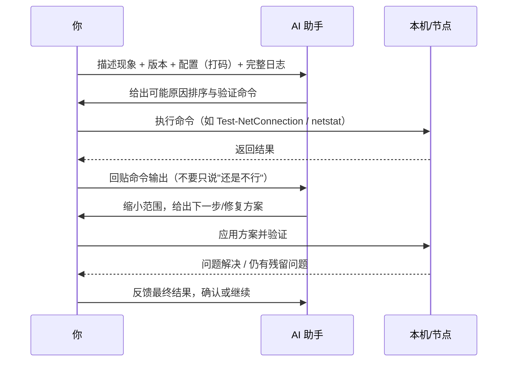

# 询问 AI 解决问题

AI（如 deepseek、豆包、kimi 等各类 AI 助手）擅长**解读日志、解释报错、给出排查命令和配置写法**，但它看不到你的账号、节点状态和面板数据，也不能替你操作平台。

回[常见问题首页](./)可查看完整的解决路径。

## AI 能做什么、不能做什么

| AI 擅长 | AI 做不到 |
| --- | --- |
| 解释 frpc 日志中的报错含义 | 查询你的 Token、流量、订单 |
| 根据现象给出可能原因与排查顺序 | 重启节点、解封账号、修改套餐 |
| 帮你写 / 检查 `frpc.toml` 配置 | 保证答案一定正确（可能过时或猜错环境） |
| 解释 ping、netstat、mtr 等命令输出 | 访问你内网机器做实际检测 |

## 提问前先备齐五样信息

信息越完整，AI 的回答越准，通常只需一次往返：

1. **环境**：操作系统（Windows 11 / Ubuntu 22.04 等）、frpc 版本（`frpc -v`）、节点要求的版本；
2. **配置**：隧道类型与关键配置（`frpc.toml` 中**把 Token 改成 `xxx` 再贴**）；
3. **日志**：frpc 从启动到报错的完整日志，最好是 `log.level = "debug"`；
4. **现象**：完全不通还是时通时断？什么时候开始？本机能访问、外部不能等对比结果；
5. **已尝试**：你已经做过哪些操作（重启过、换过节点……），避免 AI 让你重复劳动。

## 与 AI 协作的排查流程



## 可直接复制的提问模板

```text
我在用 LingYunFrp（frp 内网穿透），遇到问题：【一句话描述现象】

环境：
- 操作系统：Windows 11
- frpc 版本：v0.61.1（节点要求同版本）
- 隧道类型：tcp / udp / http / stcp（删去不适用项）
- 本地服务：127.0.0.1:8080，本机直连【正常/不正常】

现象：
- frpc 日志显示【贴关键日志，或附完整日志】
- 外部访问【节点IP:端口 或 域名】结果是【超时/拒绝连接/502……】
- 是完全不通还是偶发：……
- 从什么时候开始：……

已尝试：
- 重启 frpc / 更换网络 / 关闭防火墙：结果……

请帮我判断最可能的原因，并给出下一步验证命令。
```

## 好提问 vs 坏提问

| 坏提问（AI 只能猜） | 好提ww问（AI 能直接定位） |
| --- | --- |
| 「隧道用不了怎么办」 | 「tcp 隧道在线但外部连接超时，日志在 3 楼」 |
| 「报错了」+ 一张看不清的截图 | 粘贴报错原文：`authorization failed` |
| 「按你说的做了还是不行」 | 「执行 netstat 没查到 8080 在监听」+ 输出原文 |
| 直接贴出含 Token 的完整配置 | 贴配置但把 Token、密码替换成 `***` |

::: warning ⚠️ 两条安全红线
1. **永远不要把 FRP Token、服务器密码、私钥发给任何 AI 或公开对话**；日志里出现这些内容先打码。
2. AI 给的命令（尤其含删除、修改防火墙、开放端口的）先看懂再执行；AI 的结论要用你机器上的**实际验证结果**确认，不要盲目复制。
:::

::: tip 💡 让 AI 读文档再回答
如果 AI 对 LingYunFrp 的具体功能不了解，可以把[故障排查](../parameters/troubleshooting)或[配置文件说明](../parameters/config-file)里相关段落一并发给它，让它基于本文档而不是泛泛的 frp 印象回答。
:::

---

上一页：[常见问题解答](./common-questions) · 下一页：[寻求他人解决问题](./ask-others)
