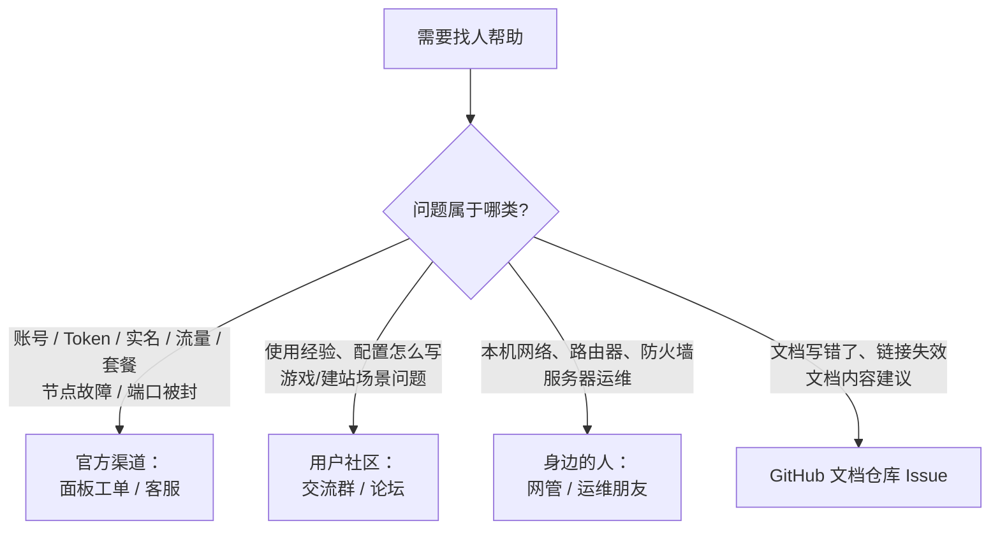

# 寻求他人解决问题

自查和 AI 都无法解决时，就该找人了。不同问题找不同渠道，找对人比群发提问快得多。

回[常见问题首页](./)可查看完整的解决路径。

## 渠道怎么选

## 四类渠道说明

| 渠道 | 适合的问题 | 入口 |
| --- | --- | --- |
| 官方工单 / 客服 | 只有平台后台能查的事：账号、Token、实名认证、流量/订单、节点故障与维护、被风控 | 登录[官网面板](https://www.lyfrp.cn)后查找「工单 / 帮助与支持 / 联系客服」入口，以面板实际提供的为准 |
| 用户交流群 / 社区 | 使用经验、配置写法、游戏开服和建站等场景问题；老用户常能秒答常见坑 | 面板/官网公告中公布的官方群或社区，**勿轻信非官方群中的收费代配置** |
| 身边懂网络的人 | 你本机/局域网相关：路由器端口、公司防火墙拦截、服务监听地址、服务器系统配置 | 公司网管、运维同事、技术朋友 |
| GitHub 文档仓库 | 文档内容错误、错别字、链接失效、内容建议 | [LingYunFrp-Docs](https://github.com/YCLY-IT/LingYunFrp-Docs) 提 Issue（页面底部也有「在 GitHub 上编辑此页」） |

## 提问时附上这份清单

把下面信息一次性给全，对方不用反复追问，参考[故障排查 · 仍然无法解决](../parameters/troubleshooting)：

- [ ] frpc 版本号与节点要求版本（`frpc -v`）
- [ ] 操作系统、网络环境（如「家里电信宽带」「公司网络」）
- [ ] 隧道类型与面板配置截图（**Token 打码**）
- [ ] frpc 完整启动日志（从启动到报错）
- [ ] 本机直连 `127.0.0.1:本地端口` 的结果
- [ ] 外部访问的完整地址与具体报错（超时 / 拒绝连接 / 502 / 证书错误……）
- [ ] 现象是完全不通还是时通时断、开始时间、已尝试过的操作

## 描述问题的正确姿势

1. **先说结论，再贴细节**：一句话说明「什么操作、期望什么结果、实际什么结果」；
2. **给复现步骤**：别人能照着重现，才有机会定位；
3. **发原文不发转述**：报错文本直接复制，截图要保证清晰完整（包含时间戳）；
4. **一个渠道问一次**：不要同时在多个群刷屏，有人接手后配合回应即可；
5. **问题解决后回报一声**：说明最终原因和解决办法，既礼貌也能帮到后来搜到同样问题的人。

## 等待回复期间可以做什么

- 按[故障排查](../parameters/troubleshooting)继续缩小范围，很多问题在这一步就自己解决了；
- 用[询问 AI 解决问题](./ask-ai)里的方法让 AI 先帮你解读日志；
- 换个网络（手机热点）或换个同线路节点做对比测试，把结果补充给帮助你的人；
- 若是节点故障，留意官方公告/群通知，可能正在统一修复。

::: danger 🔥 防骗与隐私
- 官方人员**不会**向你索取 FRP Token、账号密码；
- 不在群里、私聊中发送完整配置（含 Token）、支付截图含订单隐私信息；
- 对方让你执行不认识的命令时先问清楚作用，尤其是关闭防火墙、开放端口、运行来路不明的脚本。
:::

---

上一页：[询问 AI 解决问题](./ask-ai) · 返回[常见问题首页](./)
