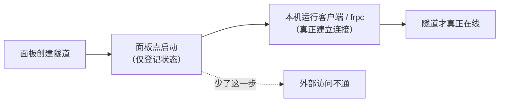

# 常见问题解答

本页汇总使用 LingYunFrp 时最高频的问题。没找到答案时，回[常见问题首页](./)看路径建议，或继续阅读[询问 AI 解决问题](./ask-ai)。

## 隧道与端口

### 网页上点了「启动隧道」为什么没打通？

网页端启动隧道不等于客户端启动隧道。要打通隧道，需要在对应的服务器或电脑上安装客户端或 frpc 并**保持运行**。详见[快速开始](../quick-start/)。



### 隧道连不上怎么办？

先按[故障排查](../parameters/troubleshooting)里的分层思路逐项检查：frpc 与节点主版本、FRP Token、隧道名与面板是否一致、本机服务是否在 `localIP:localPort` 上监听。

### 隧道显示在线，但外部就是访问不了？

「在线」只说明 frpc 与节点连上了，不代表本地服务可用。在**运行 frpc 的那台机器**上先自测：`telnet 127.0.0.1 本地端口` 或浏览器直接开 `http://127.0.0.1:本地端口`。本机能通、外部不通，再查访问地址、防火墙与域名解析，完整步骤见[故障排查 · 本地服务层](../parameters/troubleshooting)。

### 远程端口可以自己随便填吗？

不可以。远程端口是节点的公共资源，由面板在创建隧道时**统一分配**，frpc 配置必须与面板分配值一致，自己填未分配的端口会注册失败（`port unavailable`）。

### 一条隧道能映射多个端口吗？

不能。一条隧道对应一个本地端口。需要暴露多个端口（例如游戏同时要 TCP 和 UDP、网站同时要 80 和 443），就创建多条隧道，并在一个 `frpc.toml` 里写多个 `[[proxies]]` 段，见[配置文件说明](../parameters/config-file)。

### http 隧道访问时要带远程端口吗？

不用。http / https 类型共用节点的 80 / 443 端口，节点靠域名区分隧道，直接访问 `http://你的域名` 即可，但域名必须先解析到节点，见[域名解析](../scenarios/website-deploy/dns-resolve)。

## 客户端与 frpc

### 客户端和 frpc 是什么关系？必须都装吗？

两者是同一套能力的两种用法，**二选一即可**：

| 方式 | 适合谁 | 特点 |
| --- | --- | --- |
| 图形化客户端 | 普通用户、桌面电脑 | 登录账号即可管理/启动隧道，不用碰配置文件 |
| frpc 命令行 | 服务器、无图形界面、需要长期常驻 | 手写 `frpc.toml`，可配开机自启，见 [frpc 服务启动](../quick-start/service-launch) |

### Windows 下双击 frpc 一闪而过怎么办？

frpc 是命令行程序，不能双击运行。正确做法：在 frpc 所在文件夹打开 cmd / PowerShell，执行：

```powershell
frpc.exe -c .\frpc.toml
```

这样报错信息会停留在窗口里，方便排查。

### frpc / 客户端必须一直开着吗？电脑关机后隧道还能用吗？

必须。frpc 是隧道在你内网一侧的端点，**它一关，隧道立即下线**；电脑休眠、关机、断网同理。需要长期在线请：

- 保证机器常开、网络不断；
- 配置[开机自启](../advanced/auto-start)，断电重启后自动恢复；
- 服务器用户建议用 systemd / Docker 等方式守护，见[进阶使用](../advanced/)。

### 配置改了为什么不生效？

frpc 只在启动时读取一次配置。修改 `frpc.toml` 后必须**停止并重新启动** frpc 才会生效。

## 节点与网络

### 节点那么多，该怎么选？

访问者运营商混杂就选 **BGP 多线**；固定一家运营商就选对应单线或精品线路（电信 CN2 GIA / 移动 CMIN2 / 联通 9929）；再看地区远近、带宽和实时负载。完整决策方法见[节点线路选型](../parameters/node-select)。

### 联机卡顿、延迟高怎么办？

按顺序排查：

1. 让访问者 `ping` 节点，看延迟和丢包（游戏尽量 < 50ms、0% 丢包）；
2. 晚高峰卡顿多半是节点拥塞，换同线路负载更低的节点；
3. 检查你本机上行带宽是否被占满（内网穿透瓶颈通常在上行）；
4. 游戏用了 `udp` 隧道却建成 `tcp`，也会明显卡顿。

### 为什么 ping 节点不通？

很多节点出于安全考虑**禁止 ICMP**，ping 不通不代表不能用。用 `Test-NetConnection 节点域名 -Port 7000`（Windows）或 `nc -vz 节点域名 7000`（Linux）测实际连接端口，以 frpc 能否登录成功为准。

### 为什么有些节点提示要实名认证？

部分节点依据合规要求，必须完成实名认证后才能在上面创建隧道，按面板指引完成认证即可。

## 网站与域名

### 没有自己的域名，可以用 http 隧道吗？

http / https 隧道必须绑定域名。没有域名时：

- 临时使用：用 `tcp` 隧道，通过 `节点IP:远程端口` 访问；
- 正规建站：购买一个域名并备案（解析到国内节点通常要求备案），再按[部署网站](../scenarios/website-deploy/)配置。

### 域名解析后多久生效？为什么还是打不开？

DNS 解析通常几分钟内生效，最长可能受 TTL 影响达数小时。排查顺序：

1. `nslookup 你的域名`，确认返回的 IP 是**当前节点** IP（换过节点要改解析）；
2. 确认面板隧道类型为 http/https 且 `customDomains` 里填了这个域名；
3. 国内节点确认域名已备案，否则可能被拦截。

### HTTPS / 证书报错怎么处理？

证书与域名不匹配、过期，或回源端口配置错误都会报错，处理方式见 [SSL 证书](../scenarios/website-deploy/ssl-cert)。

## 账号、Token 与流量

### FRP Token 在哪里？泄露了怎么办？

Token 是 frpc 登录节点的凭证，在面板的个人/账号信息页可以查看，它代表隧道所有权。**一旦怀疑泄露（截图外传、配置文件公开），立即在面板重置 Token**，并同步更新所有 frpc 配置与客户端登录状态。

### 流量是怎么计算的？

流量为隧道上下行流量之和，单位通常为 MB/GB，具体统计口径与套餐以面板页面说明为准。网页浏览、远程命令行消耗很小；文件传输、视频、多人游戏是流量大户。

### 签到、积分有什么用？

每日签到可领取积分和流量奖励，规则以面板活动页面为准。

---

没解决你的问题？继续看：[询问 AI 解决问题](./ask-ai) · [寻求他人解决问题](./ask-others)
