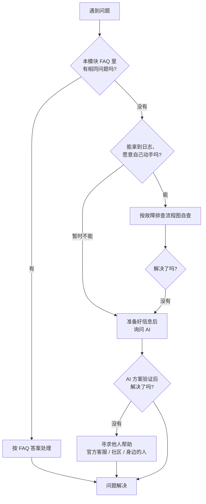

# 常见问题

遇到问题别慌，解决路径按成本从低到高分三块：**先查常见问题 → 自查仍无果就问 AI → 最后寻求他人（官方/社区）帮助**。本模块按这三块组织为三个页面。

## 我该先走哪条路？

::: tip 💡 三条路不是互斥的
最高效的方式是组合使用：FAQ 解决常识问题，[故障排查](../parameters/troubleshooting)给你定位方法，AI 帮你解读日志，官方/社区处理账号、节点、流量等**只有平台方能查**的问题。
:::

## 三个页面

| 页面 | 解决什么 | 什么时候看 |
| --- | --- | --- |
| [常见问题解答](./common-questions) | 隧道端口、客户端、节点网络、网站域名、账号流量等高频问答 | 遇到问题先翻这里 |
| [询问 AI 解决问题](./ask-ai) | 怎么向 AI 高效提问：准备信息、提问模板、协作流程与安全红线 | 自查无果、想让 AI 解读日志时 |
| [寻求他人解决问题](./ask-others) | 官方客服 / 用户社区 / 身边的人 / GitHub 四类渠道怎么选、怎么提问 | AI 也解决不了，需要平台方或他人协助时 |

## 相关文档

- 分层定位问题：[故障排查](../parameters/troubleshooting)
- 配置怎么写：[配置文件说明](../parameters/config-file)
- 隧道类型怎么选：[服务端参数](../parameters/server-params)
- 节点与线路：[节点线路选型](../parameters/node-select)
