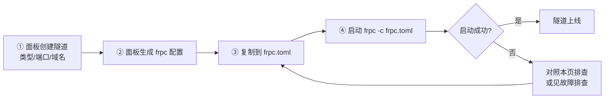
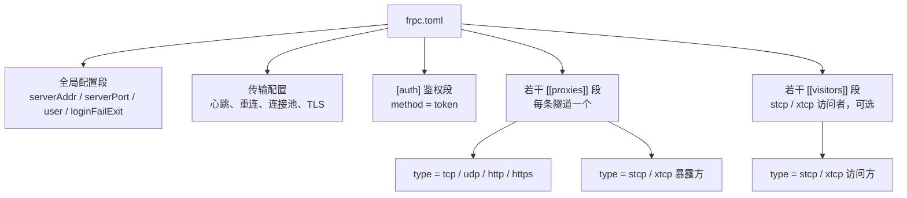
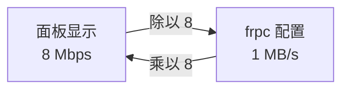

# 配置文件说明

frpc 启动时读取一个配置文件（新版为 `frpc.toml`），里面写明：连哪个节点、用什么 Token 登录、转发本机哪些端口。

**一般不用手写配置**：在面板「创建隧道」完成后，平台会直接生成好整段内容，复制粘贴到 `frpc.toml` 即可。手写主要用于一台机器同时跑多条隧道、或需要自定义心跳/加密等高级参数的场景。

## 从面板获取配置



::: tip 💡 一个配置文件可以放多条隧道
`[[proxies]]` 段可以重复出现多次，一次启动即可注册全部隧道，无需开多个 frpc 进程。各隧道通过 `name` 区分。
:::

## 配置文件结构总览

frp v0.52.0 起默认配置格式为 **TOML**，一个完整配置由四部分组成：



| 部分 | 对应写法 | 是否必须 | 作用 |
| --- | --- | --- | --- |
| 全局配置 | 文件顶部的零散键值 | 必须 | 指定节点地址、登录用户、行为开关 |
| 传输配置 | `transport.xxx` | 可选 | 心跳间隔、超时、连接池等，用默认值一般即可 |
| 鉴权段 | `[auth]` | 必须 | 填写 FRP Token |
| 隧道段 | `[[proxies]]` | 必须 | 每条隧道一段，声明转发规则 |
| 访问者段 | `[[visitors]]` | 可选 | 仅 stcp / xtcp 的访问方需要 |

## frpc 配置（TOML，v0.52.0 及以上）

### 完整示例

下面示例包含 2 条普通 TCP 隧道、1 条 UDP 隧道、1 条 HTTP 域名隧道，以及 1 个 stcp 访问者：

```toml
# ===== ① 全局配置 =====
serverAddr = "hz.example.com"   # 节点地址（面板提供，域名或 IP）
serverPort = 7000               # 节点连接端口（面板提供）
user = "abcd1234efgh5678"       # 用户名/用户标识，一般填 FRP Token

# ===== ② 传输与重连（可选，保持默认即可） =====
transport.heartbeatInterval = 30            # 心跳间隔（秒）
transport.heartbeatTimeout = 90             # 心跳超时（秒），超时判定断线
transport.tcpMuxKeepaliveInterval = 30      # 多路复用保活间隔（秒）
transport.dialServerTimeout = 10            # 连接节点的超时时间（秒）
transport.protocol = "tcp"                  # 传输协议：tcp / kcp / quic / websocket
# transport.tls.enable = true              # 节点要求 TLS 时打开

loginFailExit = false           # 登录失败不退出进程，持续重试（建议 false）

# ===== ③ 鉴权 =====
[auth]
method = "token"
token = "abcd1234efgh5678"      # 你的 FRP Token，与面板一致

# ===== ④ 隧道段：每段一条隧道 =====
[[proxies]]
name = "web_tunnel"             # 隧道名，账号下必须唯一，需与面板一致
type = "tcp"
localIP = "127.0.0.1"           # 本机服务地址
localPort = 8080                # 本机服务端口
remotePort = 13578              # 节点远程端口（面板分配）
transport.useEncryption = true  # frpc ↔ frps 之间加密
transport.useCompression = true # frpc ↔ frps 之间压缩
transport.bandwidthLimit = "10MB"  # 该隧道带宽上限，单位为 MB/s

[[proxies]]
name = "ssh_tunnel"
type = "tcp"
localIP = "127.0.0.1"
localPort = 22
remotePort = 13579

[[proxies]]
name = "mc_server"
type = "udp"
localIP = "127.0.0.1"
localPort = 25565
remotePort = 13580

[[proxies]]
name = "my_website"
type = "http"
localIP = "127.0.0.1"
localPort = 8080
customDomains = ["www.example.com"]  # http/https 类型用域名而非端口

# ===== ⑤ 访问者段：仅 stcp / xtcp 需要 =====
[[visitors]]
name = "mc_visitor"
type = "stcp"
serverName = "secret_mc"           # 对应暴露方隧道的 name
secretKey = "a-strong-shared-key"  # 与暴露方完全一致
bindAddr = "127.0.0.1"
bindPort = 25566                   # 访问方本地监听端口
```

### 全局参数

| 参数 | 类型 | 必填 | 默认值 | 说明 |
| --- | --- | --- | --- | --- |
| `serverAddr` | string | 是 | - | 节点地址，面板节点详情页给出，域名或 IP |
| `serverPort` | number | 是 | `7000` | frpc 连接节点的端口 |
| `user` | string | 视面板要求 | - | 用户标识，LingYunFrp 一般填 FRP Token |
| `loginFailExit` | bool | 否 | `true` | 登录失败是否退出。建议设 `false`，断网后自动重连 |
| `transport.protocol` | string | 否 | `tcp` | 与节点通信的底层协议：`tcp`/`kcp`/`quic`/`websocket`/`wss` |
| `transport.tls.enable` | bool | 否 | `false` | 是否强制 TLS 加密连接，节点要求时必须开启 |
| `log.to` | string | 否 | 控制台 | 日志输出位置，如 `"./frpc.log"` 写文件 |
| `log.level` | string | 否 | `info` | 日志级别：`trace`/`debug`/`info`/`warn`/`error` |
| `log.maxDays` | number | 否 | 0 | 日志文件保留天数 |

### 心跳与重连参数

| 参数 | 默认值 | 说明 |
| --- | --- | --- |
| `transport.heartbeatInterval` | `30` | 每隔多少秒向节点发一次心跳，维持连接 |
| `transport.heartbeatTimeout` | `90` | 多少秒没收到心跳回应就判定断线并触发重连 |
| `transport.dialServerTimeout` | `10` | 首次连接节点的超时秒数 |
| `transport.tcpMuxKeepaliveInterval` | `30` | TCP 多路复用连接的保活探测间隔 |
| `transport.poolCount` | `0` | 预建连接池大小，需要极低延迟、频繁建连时可调大（如 `5`） |

::: tip 💡 心跳参数一般不用改
家用宽带 NAT 会话老化可能导致连接静默断开，若隧道「显示在线但实际不通」，可把 `heartbeatInterval` 调小到 `20`，让 NAT 表项持续刷新。
:::

### `[[proxies]]` 隧道参数

| 参数 | 适用类型 | 说明 |
| --- | --- | --- |
| `name` | 全部 | 隧道名，**账号内唯一**，必须与面板一致 |
| `type` | 全部 | `tcp` / `udp` / `http` / `https` / `stcp` / `xtcp` |
| `localIP` | 全部 | 本地服务地址。本机服务填 `127.0.0.1`；转发局域网内其他机器填其内网 IP（如 `192.168.1.10`） |
| `localPort` | 全部 | 本地服务监听端口 |
| `remotePort` | tcp / udp | 节点远程端口，面板分配，不能自己随意写 |
| `customDomains` | http / https | 绑定的域名数组，如 `["a.com", "www.a.com"]` |
| `subdomain` | http / https | 子域名（节点提供泛域名时使用，与 `customDomains` 二选一） |
| `secretKey` | stcp / xtcp | 点对点密钥，暴露方与访问方必须完全一致 |
| `transport.useEncryption` | 全部 | frpc 与节点之间的流量是否加密（默认 `false`） |
| `transport.useCompression` | 全部 | 是否启用压缩（默认 `false`），文本类流量收益明显 |
| `transport.bandwidthLimit` | 全部 | 隧道带宽上限，如 `"10MB"`，单位 **MB/s** |
| `transport.bandwidthLimitMode` | 全部 | 限速由哪端执行：`client`（默认，frpc 端）/ `server`（节点端） |

### `[[visitors]]` 访问者参数

访问者段只用于 **stcp / xtcp**：别人用 `[[proxies]]` 把服务私密暴露出来，你用 `[[visitors]]` 把它「接」到自己电脑上。

| 参数 | 说明 |
| --- | --- |
| `name` | 访问者名称，本地唯一即可 |
| `type` | 必须与对方隧道类型一致：`stcp` 或 `xtcp` |
| `serverName` | 对方（暴露方）隧道的 `name` |
| `secretKey` | 双方约定的密钥，**必须完全一致**，否则连不上 |
| `bindAddr` | 在你本机监听的地址，一般填 `127.0.0.1` |
| `bindPort` | 在你本机监听的端口，之后用 `127.0.0.1:bindPort` 访问服务 |

完整 stcp 双端示例见 [frpc 部署示例](../scenarios/game-server/frpc-demo)。

## frpc 配置（INI，v0.51.0 及更早的老版本）

老版本 frp 使用 ini 格式，段落用 `[名称]` 表示，键名是下划线风格：

```ini
[common]
server_addr = hz.example.com
server_port = 7000
user = abcd1234efgh5678
token = abcd1234efgh5678
login_fail_exit = false
heartbeat_interval = 30
heartbeat_timeout = 90

[web_tunnel]
type = tcp
local_ip = 127.0.0.1
local_port = 8080
remote_port = 13578
use_encryption = true
use_compression = true
bandwidth_limit = 10MB

[ssh_tunnel]
type = tcp
local_ip = 127.0.0.1
local_port = 22
remote_port = 13579
```

两种格式的对应关系：

| TOML（新） | INI（旧） |
| --- | --- |
| `serverAddr` | `server_addr` |
| `serverPort` | `server_port` |
| `loginFailExit` | `login_fail_exit` |
| `[auth]` 下的 `token` | `[common]` 下的 `token` |
| `[[proxies]]` + `name` | `[隧道名]` 段 |
| `localIP` / `localPort` | `local_ip` / `local_port` |
| `remotePort` | `remote_port` |
| `transport.useEncryption` | `use_encryption` |
| `customDomains = ["a.com"]` | `custom_domains = a.com` |

::: warning ⚠️ 不要两种格式混用
一个配置文件只能是一种格式。TOML 文件里出现 `[common]`、或 INI 文件里出现 `[[proxies]]`，frpc 启动都会报解析错误。
:::

## 版本匹配

frpc 与节点 frps 的**主版本号必须一致**（例如节点是 v0.61.x，frpc 也用 v0.61.x）：

- 主版本不一致：可能直接握手失败、报字段不识别（`unknown field`），或行为异常；
- 同主版本、小版本不同：通常兼容，但仍建议保持完全一致。

节点要求的 frpc 版本以面板节点详情页为准，下载方式见 [frpc 服务启动](../quick-start/service-launch)。

## 启动与校验配置

```bash
# 校验配置文件语法是否正确（不会真正连接节点）
frpc verify -c ./frpc.toml

# 用指定配置启动
frpc -c ./frpc.toml
```

- `verify` 通过只能说明**语法正确**；Token 错、远程端口被占用等问题要启动后看日志才知道。
- 启动成功的标志：日志中出现 `login to server success`，且每条隧道出现 `start proxy success`。
- Windows 下命令为 `frpc.exe -c .\frpc.toml`，需在命令行（cmd / PowerShell）中执行。

## 带宽单位换算

面板上显示的带宽单位是 **Mbps（兆比特每秒）**，frpc 配置里 `bandwidthLimit` 的单位是 **MB/s（兆字节每秒）**，两者相差 8 倍：



```text
8 Mbps = 1 MB/s
```

常见换算速查：

| 面板带宽（Mbps） | frpc 限速（MB/s） | 大致能做什么 |
| --- | --- | --- |
| 5 | 0.625 MB | 仅够 SSH、文本网页 |
| 10 | 1.25 MB | 远程桌面、轻度联机 |
| 20 | 2.5 MB | 多数游戏联机、普通网站 |
| 50 | 6.25 MB | 多人游戏、图片较多的站点 |
| 100 | 12.5 MB | 大文件传输、视频类服务 |

面板中编辑/创建隧道时，还可以设置每个接入 IP 的带宽限制：

| 面板字段 | 含义 |
| --- | --- |
| `ipLimitIn`（进站带宽） | 限制每个 IP **下载**（节点 → 访问者）的速度 |
| `ipLimitOut`（出站带宽） | 限制每个 IP **上传**（访问者 → 节点）的速度 |

::: tip 💡 限速方向不要搞反
访问者从隧道下载数据，对节点而言是「出站」、对你的 frpc 而言是「下行」。填写限速前先确认当前字段站在哪一端描述方向。
:::

## 常见配置错误

| 现象 / 报错 | 原因 | 处理 |
| --- | --- | --- |
| 启动报解析错误（parse error） | TOML 语法错误：漏引号、漏等号、表段顺序错乱 | 用 `frpc verify` 校验；对照官方模板检查 |
| `unknown field` | frpc 版本过旧，不认识新字段 | 升级到与节点一致的主版本 |
| `authorization failed` / token 错误 | `[auth].token` 与面板 FRP Token 不一致 | 复制面板最新 Token，注意不要带空格 |
| `proxy ... already exists` / 名称冲突 | `name` 在账号下重复，或面板没删干净 | 改名或删除面板上的同名隧道 |
| 端口不可用 / `port unavailable` | `remotePort` 与面板分配的不一致或被他人占用 | 以面板分配端口为准，不能自行填写 |
| 配置改了但不生效 | frpc 未重启，仍在跑旧配置 | 停止后重新执行 `frpc -c frpc.toml` |
| http 隧道无法访问 | 用了 `remotePort` 而不是 `customDomains`，或域名未解析 | 见[域名解析](../scenarios/website-deploy/dns-resolve) |

更多报错的完整排查路径见 [故障排查](./troubleshooting)。
