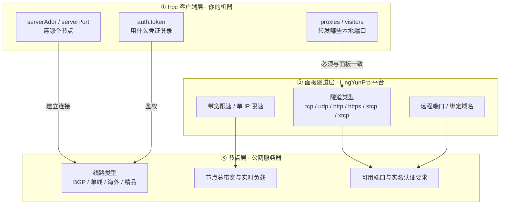

# 参数详解

这一模块讲清楚 LingYunFrp 涉及的各类参数：配置文件写法、隧道参数含义、节点线路选型，以及遇到问题时如何排查。

## 参数全景图

一条隧道要跑通，会经过三层配置，每层负责的事情不同：

- **① frpc 客户端层**：写在 `frpc.toml` 里，决定 frpc 怎么连节点、转发本机哪个端口。详见[配置文件说明](./config-file)。
- **② 面板隧道层**：在 LingYunFrp 面板「创建隧道」时填写，决定这条隧道的类型、远程端口/域名和限速。面板创建后会**直接生成好 frpc 配置**，通常不需要手写。详见[服务端参数](./server-params)。
- **③ 节点层**：由节点本身决定，你只能选择、不能修改。选节点时重点看线路和带宽。详见[节点线路选型](./node-select)。

::: warning ⚠️ 两处参数必须一致
frpc 配置里的隧道名、类型、远程端口/域名，必须与面板上创建的隧道**完全对应**。任何一处对不上（典型如 Token 错误、隧道名不一致），都会导致注册失败，按[故障排查](./troubleshooting)处理。
:::

## 本模块页面

| 页面 | 内容 | 什么时候看 |
| --- | --- | --- |
| [配置文件说明](./config-file) | frpc 的 toml / ini 配置结构、字段含义、完整示例、带宽单位换算 | 手写配置、调试配置文件时 |
| [服务端参数](./server-params) | 六种隧道类型与各类型必填参数、加密压缩、限速 | 创建隧道、不确定该选什么类型时 |
| [节点线路选型](./node-select) | BGP / 单线 / 海外 / 精品线路区别，带宽估算与延迟测试 | 选择或更换节点时 |
| [故障排查](./troubleshooting) | 分层排查流程图、日志关键字对照、常用网络命令 | 隧道连不上、启动报错时 |

## 建议阅读顺序

1. 第一次创建隧道：先读[服务端参数](./server-params)，弄清六种类型怎么选；
2. 面板生成的配置看不懂：读[配置文件说明](./config-file)逐字段对照；
3. 联机卡顿、延迟高：读[节点线路选型](./node-select)评估线路和带宽；
4. 出了问题：直接跳到[故障排查](./troubleshooting)按流程图定位。
