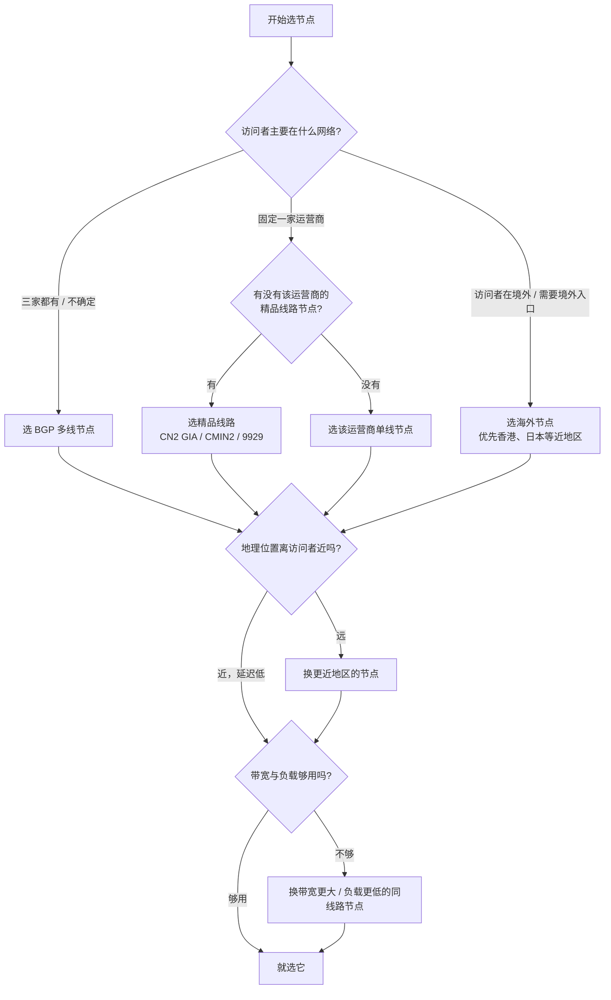

# 节点线路选型

隧道的访问体验由两截链路决定：**访问者 → 节点**、**节点 → 你的 frpc**。节点选得不对，任一截慢，整条链路就慢。选择节点时核心看三件事：**线路类型、地理位置、带宽与负载**。

## 延迟是怎么来的


- **第①段**是选型能优化的重点：访问者（玩家/访客）用什么宽带，决定了应该选 BGP、单线还是精品线路。
- **第②段**取决于你自己电脑的网络：你是电信宽带，就尽量选电信友好的节点。
- 游戏联机对**延迟（ms）和抖动**敏感；下载/视频对**带宽（Mbps）**敏感；两者不是一回事。

## 线路类型

线路类型决定不同运营商用户访问节点的速度。

| 线路 | 解释 | 延迟表现 | 适合谁 |
| --- | --- | --- | --- |
| BGP 多线 | 节点同时接入电信、移动、联通三大运营商，按来源自动走最优路由 | 三网用户延迟都较低、最均衡 | 访问者运营商混杂（好友联机、公共服务），**首选** |
| 单线 | 只接入三大运营商中的一个 | 同运营商用户延迟低；跨运营商延迟高、抖动大甚至丢包 | 你和访问者都是同一家宽带 |
| 精品线路（CN2 GIA / CMIN2 / 9929） | 电信 CN2 GIA、移动 CMIN2、联通 9929 的优化回国/骨干线路 | 延迟约 20~50ms，晚高峰也稳 | 对应运营商用户追求稳定低延迟 |
| 海外线路 | 位于境外（港、日、美等）的服务器 | 国内访问约 80~400ms，距离越远越高，部分网络无法直连 | 需要境外入口的服务 |

### 运营商 × 线路对照

| 访问者网络 | BGP 多线 | 电信单线/CN2 | 联通单线/9929 | 移动单线/CMIN2 |
| --- | --- | --- | --- | --- |
| 电信用户 | 好 | **最好** | 一般（跨网） | 差（跨网） |
| 联通用户 | 好 | 一般（跨网） | **最好** | 差（跨网） |
| 移动用户 | 好 | 差（跨网） | 差（跨网） | **最好** |

::: tip 💡 看不懂运营商，就选 BGP
只要不知道访问者会用什么网络，BGP 多线是不会错的选择——它用 BGP 协议让每家运营商走自己的互联链路，避免跨网抖动。
:::

### 精品线路三个名字别搞混

| 名称 | 运营商 | 说明 |
| --- | --- | --- |
| CN2 GIA | 中国电信 | 电信下一代承载网的高端产品等级，晚高峰质量稳定 |
| CMIN2 | 中国移动 | 移动国际/骨干优化线路（CMI 的升级） |
| 9929（AS9929） | 中国联通 | 联通工业/高端骨干网，又称 CUII/A 网 |

它们只对**对应运营商**的用户效果最好，电信用户用 CMIN2 节点仍然要跨网。

## 选线决策流程



## 地理位置怎么选

在同线路类型下，节点离你和访问者越近，延迟越低，大致规律：

| 你的位置 / 访问者位置 | 优先地区 |
| --- | --- |
| 华东（沪苏浙皖闽） | 上海、杭州、南京 |
| 华北（京津冀鲁） | 北京、天津、青岛 |
| 华南（粤桂琼） | 广州、深圳、香港 |
| 西南（川渝云贵） | 成都、重庆 |
| 华中（豫鄂湘） | 武汉、郑州 |
| 访问者在境外 | 就近选香港、日本、新加坡、美西 |

::: warning ⚠️ 直线距离 ≠ 网络距离
网络路径要经过运营商骨干路由，两个地理上很近但分属不同运营商网络的节点，延迟可能反而更高。地理选择只是第一步，**以实测延迟为准**。
:::

## 带宽够不够用

带宽（Mbps）决定节点每秒最大传输能力。游戏联机延迟优先、带宽其次；但网站、文件分享、视频类服务会直接吃满带宽。与 frpc 配置单位的换算见[配置文件说明 · 带宽单位换算](./config-file#带宽单位换算)。

常见场景的带宽需求参考（取**上行**需求，内网穿透的瓶颈通常在你本机和节点的上行）：

| 场景 | 单用户典型需求 | 建议节点带宽 |
| --- | --- | --- |
| SSH / 远程命令行 | < 1 Mbps | 5 Mbps 即可 |
| 网页浏览（文本为主） | 1~3 Mbps | 10 Mbps |
| Minecraft 等方块游戏联机 | 0.1~1 Mbps/人 | 10~20 Mbps（人数多再上调） |
| 实时动作类游戏（UDP） | 0.5~2 Mbps/人，对抖动极敏感 | 20 Mbps + 低延迟线路 |
| Windows 远程桌面 | 2~10 Mbps | 20 Mbps |
| 文件下载 / NAS 传文件 | 越大越好 | 50~100 Mbps |
| 视频流 / 监控画面 | 2~8 Mbps/路 | 50 Mbps 起 |

估算公式：`所需带宽 ≈ 单用户需求 × 同时在线人数 × 1.5（突发余量）`。

::: tip 💡 共享带宽看峰值
节点带宽通常是多人共享的，面板上显示的实时负载/在用带宽比标称带宽更有参考价值。晚高峰（20:00~23:00）是最值得观察的时段。
:::

## 动手实测：延迟与丢包

不要只看面板参数，创建隧道前先用命令实测你（以及让访问者）到节点的网络质量。

### Windows

```powershell
# 持续 ping，看延迟（时间=）和丢包（请求超时）
ping 节点域名

# ping 不通 ICMP 时（很多节点禁 ping），测 TCP 端口连通性
# PowerShell 自带：
Test-NetConnection 节点域名 -Port 7000

# 路由跟踪，看绕路发生在哪一跳
tracert 节点域名
```

### Linux / macOS

```bash
#  ping 20 次统计
ping -c 20 节点域名

# TCP 端口探测
telnet 节点域名 7000
# 或（更推荐）
nc -vz 节点域名 7000

# 路由路径 + 每跳丢包率（mtr）
mtr -rwzbc 50 节点域名
```

结果怎么读：

| 指标 | 好 | 一般 | 差 |
| --- | --- | --- | --- |
| 延迟（avg） | < 50ms | 50~100ms | > 150ms（游戏会明显卡） |
| 抖动（max-min 差） | < 10ms | 10~30ms | > 50ms（技能时灵时不灵） |
| 丢包率 | 0% | 0~1% | > 3%（必换线路） |

::: warning ⚠️ 节点禁 ping 不代表连不上
出于安全考虑，很多节点服务器会禁止 ICMP（ping 超时）。判断连通性请以 `Test-NetConnection` / `telnet 节点端口` 和 frpc 能否登录成功为准。
:::

## 看面板上的哪些指标

| 指标 | 怎么用 |
| --- | --- |
| 线路类型 / 地区 | 按上文决策流程粗筛 |
| 节点带宽 | 对照场景带宽表 |
| 在线隧道数 / 实时负载 | 越接近满载，晚高峰越容易堵；同类节点选负载低的 |
| 实名认证要求 | 部分节点需完成实名后才能创建隧道 |
| 节点状态 | 维护中/离线的节点直接排除 |

## 切换节点

一条隧道创建在某个节点上，**远程端口和域名解析都绑定该节点**。切换节点意味着：


1. 在目标节点上重新创建隧道（同类型、同本地端口即可）；
2. 用面板新生成的配置更新 `frpc.toml`：`serverAddr`、`serverPort`、`remotePort` 都可能变化；
3. http / https 隧道记得把域名解析（A 记录）改到新节点 IP，见[域名解析](../scenarios/website-deploy/dns-resolve)；
4. 重启 frpc，确认新隧道 `start proxy success` 后，再删除旧节点上的隧道，避免端口/名称残留。

## 选型检查清单

- [ ] 访问者运营商：混杂选 BGP，固定选对应单线/精品
- [ ] 地区：优先选离你和访问者都近的节点
- [ ] 实测：`ping` / `Test-NetConnection` 延迟、抖动、丢包达标
- [ ] 带宽：按 `单用户需求 × 人数 × 1.5` 估算并留余量
- [ ] 负载：避开晚高峰接近满载的节点
- [ ] 要求：完成该节点要求的实名认证
- [ ] 选好仍不满意：按上文「切换节点」流程迁移，别忘记改域名解析
