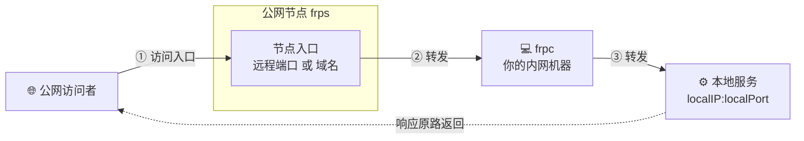
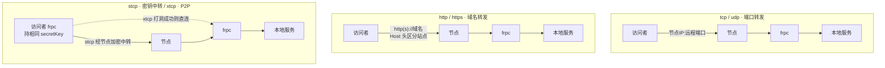
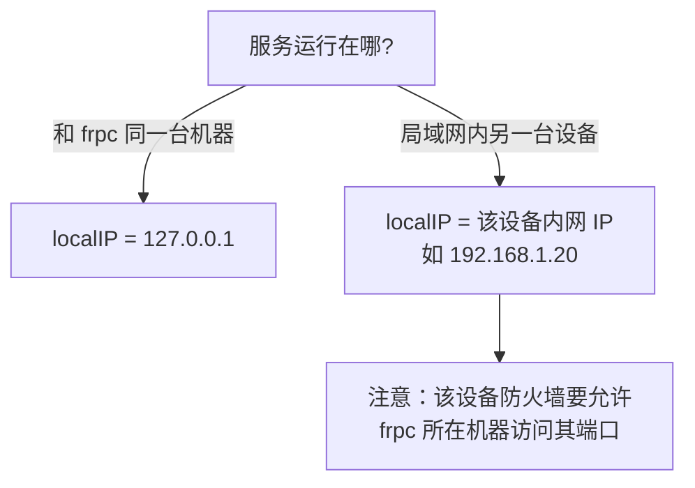
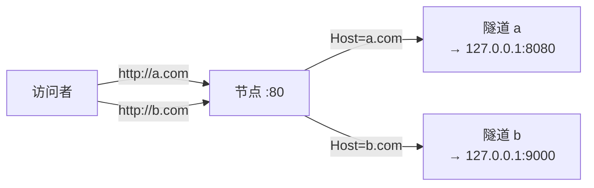
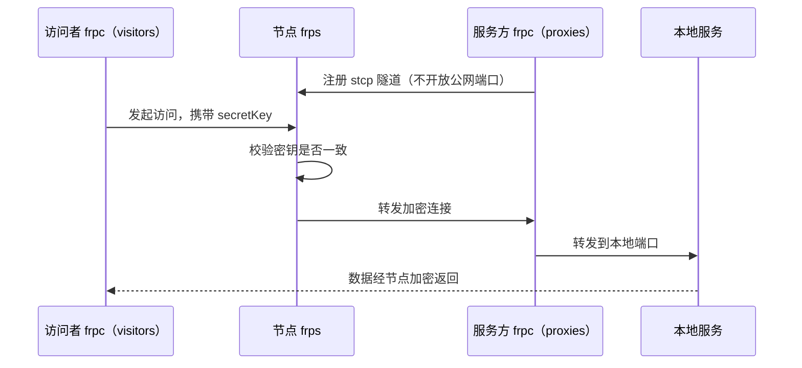
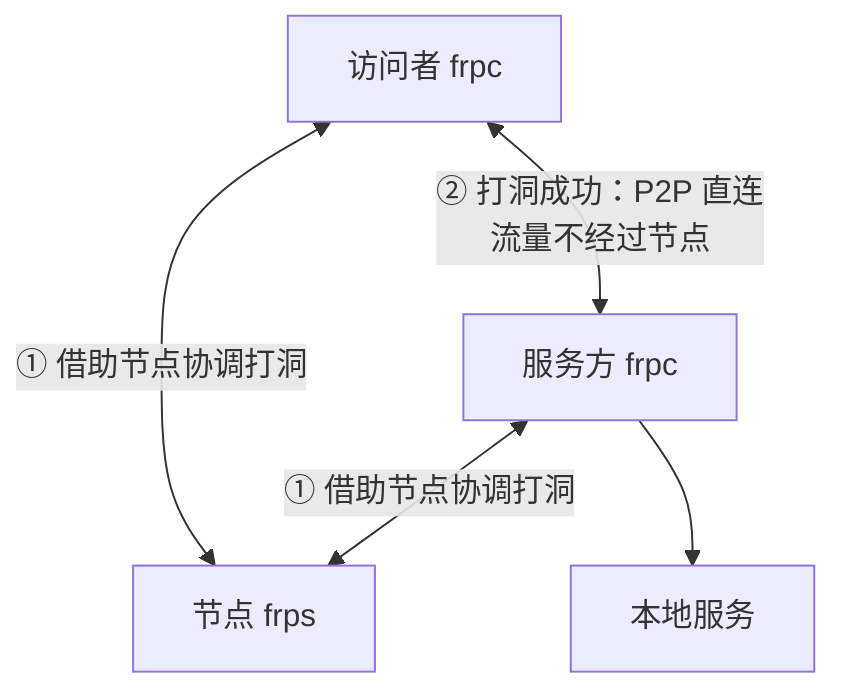
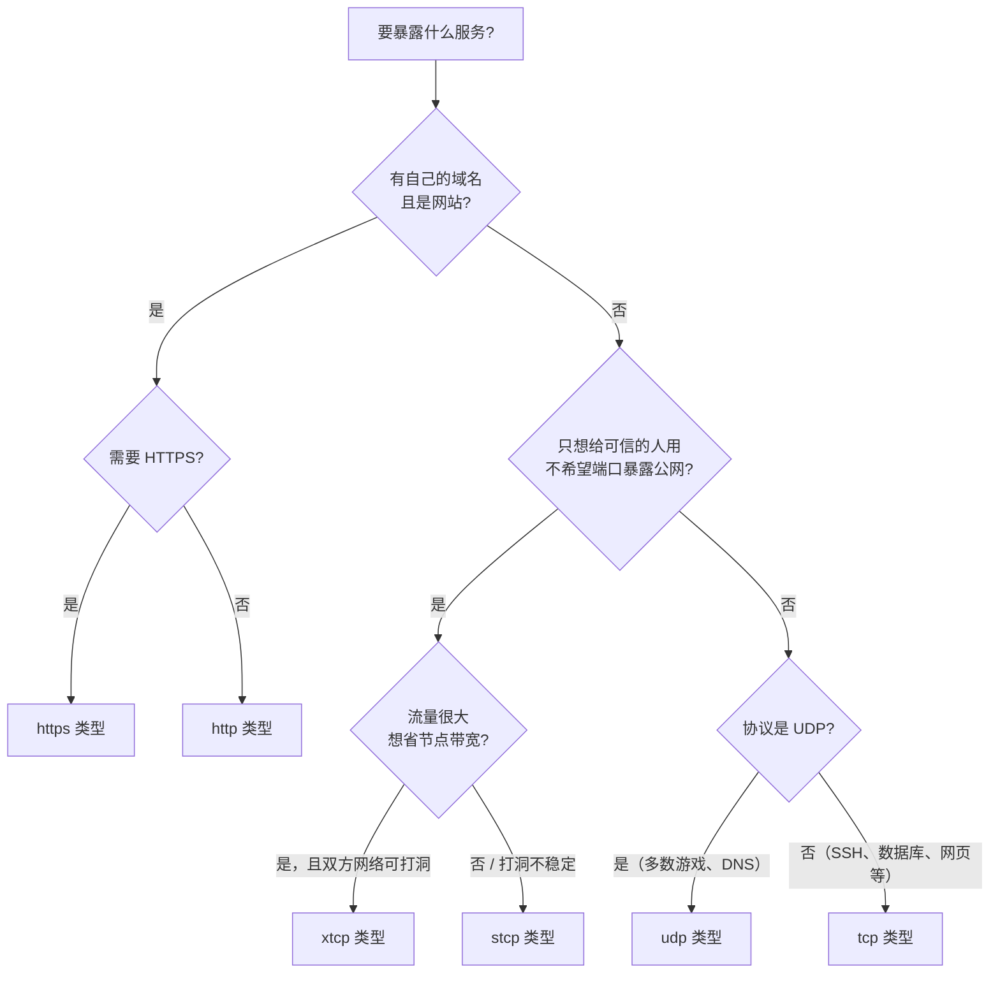

# 服务端参数

「服务端参数」指在 LingYunFrp 面板**创建隧道**时填写的参数：隧道类型、本地/远程端口、绑定域名、密钥与限速等。这些参数会同步到节点（frps），并体现在面板为你生成的 frpc 配置中。

本页逐一解释这些参数的含义，以及六种隧道类型分别怎么填。

## 一条隧道的完整数据通路

无论哪种类型，隧道做的事都是把「本地 `IP:端口`」映射到「公网可达的入口」，区别只在**公网入口的形式**和**流量是否经过节点**：



## 隧道类型总览

| 类型 | 公网入口 | 必填字段 | 流量是否经过节点 | 常见用途 |
| --- | --- | --- | --- | --- |
| `tcp` | `节点:远程端口` | `remotePort` | 是 | SSH、数据库、远程桌面、任意 TCP 服务 |
| `udp` | `节点:远程端口` | `remotePort` | 是 | DNS、游戏服务器、QUIC 等 UDP 服务 |
| `http` | `http://你的域名`（共用 80） | `customDomains` | 是 | 多个站点共用 80 端口、按域名区分 |
| `https` | `https://你的域名`（共用 443） | `customDomains` | 是 | 需要 SNI 按域名路由的 HTTPS 站点 |
| `stcp` | 无公开入口，凭密钥访问 | `secretKey` | 是（加密） | 只给自己/好友用的私密服务 |
| `xtcp` | 无公开入口，凭密钥访问 | `secretKey` | 否，P2P 打洞直连 | 大流量传输；成功率取决于双方 NAT 类型 |

::: tip 💡 不会选？看这里
- 只是「让外面能连到我电脑上的某个端口」：用 `tcp`（游戏是 UDP 就用 `udp`）。
- 有域名、要部署网站：用 `http` / `https`，见[部署网站](../scenarios/website-deploy/)。
- 不想让任何人扫到端口、只给特定人用：用 `stcp`。
- 流量很大、不想占用节点带宽，且双方网络支持打洞：尝试 `xtcp`。
:::

## 三种转发模式对比



| 对比项 | tcp / udp | http / https | stcp | xtcp |
| --- | --- | --- | --- | --- |
| 别人怎么访问 | 节点 IP + 远程端口 | 域名 | 本地装 frpc + 密钥 | 本地装 frpc + 密钥 |
| 端口是否暴露在公网 | 暴露 | 暴露（80/443 共用） | **不暴露** | **不暴露** |
| 是否消耗节点流量 | 是 | 是 | 是 | 打洞成功后否 |
| 访问者是否需要 frpc | 否 | 否 | 是 | 是 |
| 适用人数 | 任何人 | 任何人 | 可信的少数人 | 可信的少数人 |

## 通用参数详解

以下字段在面板「创建隧道」时填写，含义与 frpc 配置一一对应。

| 面板参数 | frpc 字段 | 说明 |
| --- | --- | --- |
| 隧道名称 | `name` | 账号内**唯一**，frpc 注册隧道时靠它与面板记录匹配；改名等于新建 |
| 隧道类型 | `type` | 六种之一，决定下面哪些字段生效 |
| 本地地址 | `localIP` | 服务在哪台机器。服务和 frpc 在同一台机器填 `127.0.0.1`；在局域网另一台机器填其内网 IP |
| 本地端口 | `localPort` | 服务实际监听的端口，如 SSH 为 `22`、Minecraft 为 `25565`、HTTP 服务常为 `8080` |
| 远程端口 | `remotePort` | 节点上对外的端口，**由面板分配**，不能自己指定未分配的端口 |
| 绑定域名 | `customDomains` | http / https 类型使用，域名需先解析到节点，见[域名解析](../scenarios/website-deploy/dns-resolve) |
| 访问密钥 | `secretKey` | stcp / xtcp 使用，双方必须完全一致，建议用足够长的随机字符串 |

### 本地地址怎么填



::: warning ⚠️ 常见低级错误
- 服务只监听在 `127.0.0.1`，但 frpc 填了局域网 IP：连不上。要么改 frpc 的 `localIP`，要么让服务监听 `0.0.0.0`。
- 本地端口写错：frpc 能上线，但访问报 `connection refused`。
- `127.0.0.1` 只能由本机访问，不能在本地地址里填访问者的 IP。
:::

## 各类型配置示例

### tcp / udp：端口转发

最常用的类型，一条映射：`节点IP:remotePort` → `localIP:localPort`。

```toml
[[proxies]]
name = "ssh_tunnel"
type = "tcp"
localIP = "127.0.0.1"
localPort = 22
remotePort = 13579
```

- 访问方式：`ssh -p 13579 用户名@节点IP`
- UDP 仅需把 `type` 改成 `"udp"`（游戏、DNS 等），其余字段相同。
- 同一服务同时有 TCP 和 UDP（部分游戏）：建**两条**隧道，`name` 和 `remotePort` 各不同。

### http：域名转发（80 端口复用）

节点 80 端口被所有 http 隧道共用，节点根据 HTTP 请求头里的 `Host`（域名）把流量送到对应隧道：



```toml
[[proxies]]
name = "blog"
type = "http"
localIP = "127.0.0.1"
localPort = 8080
customDomains = ["blog.example.com"]
```

- 一个隧道可绑多个域名：`customDomains = ["a.com", "www.a.com"]`。
- 域名必须先做 A 记录解析到节点 IP，否则访问会落到错误的地方，见[域名解析](../scenarios/website-deploy/dns-resolve)。
- 访问时直接用 `http://域名`，**不带端口**（节点用 80）。

### https：域名转发（443 / SNI）

与 http 同理，只是走 443 并按 TLS 的 SNI 区分隧道：

```toml
[[proxies]]
name = "secure_site"
type = "https"
localIP = "127.0.0.1"
localPort = 8443
customDomains = ["secure.example.com"]
```

证书放哪一端分两种情况：

| 方案 | 说明 | 参考 |
| --- | --- | --- |
| 本地 HTTPS 服务自己持有证书 | frpc 原样转发 443 流量到本地 HTTPS 端口（如 8443） | 最常用，配置最简单 |
| 节点统一卸载证书 | 在节点/面板侧配置证书，本地回源走 HTTP | 见 [SSL 证书](../scenarios/website-deploy/ssl-cert) |

### stcp：加密私密中转

节点上**不开放任何端口**，访问者必须也运行 frpc、配置 `[[visitors]]` 且密钥一致才能接入。流量经节点加密中转。



服务暴露方（跑服务的人）：

```toml
[[proxies]]
name = "secret_mc"
type = "stcp"
secretKey = "a-strong-shared-key"
localIP = "127.0.0.1"
localPort = 25565
```

访问方（要连服务的人）：

```toml
[[visitors]]
name = "secret_mc_visitor"
type = "stcp"
serverName = "secret_mc"
secretKey = "a-strong-shared-key"   # 必须与暴露方完全一致
bindAddr = "127.0.0.1"
bindPort = 25566                    # 之后访问 127.0.0.1:25566
```

完整双端示例见 [frpc 部署示例](../scenarios/game-server/frpc-demo)。

### xtcp：P2P 点对点打洞

配置写法与 stcp 完全相同（暴露方 `[[proxies]]` + 访问方 `[[visitors]]`），区别是建立连接后双方**尽量直连**，流量不再经过节点，因此不消耗节点带宽、速度取决于两边的本地带宽。



::: warning ⚠️ xtcp 不一定打得通
打洞成功率取决于双方 NAT 类型（对称型 NAT 通常失败）。打洞失败时访问会自动回退到经节点中转（或直接连不上，以 frp 版本行为为准）。追求**稳定可用**选 stcp，追求**大流量省钱**再尝试 xtcp。
:::

## 传输选项：加密、压缩与限速

每条隧道都可以挂以下 `transport.*` 选项：

| 选项 | 作用 | 建议 |
| --- | --- | --- |
| `transport.useEncryption` | 对 frpc ↔ 节点之间的流量加密 | 经过不可信网络、或内容敏感时开启；stcp 本身已有密钥保护 |
| `transport.useCompression` | 压缩 frpc ↔ 节点之间的流量 | 文本/网页/日志类开启收益明显；游戏、视频等已压缩数据开启反而浪费 CPU |
| `transport.bandwidthLimit` | 单条隧道带宽上限，单位 **MB/s** | 防止单条隧道占满节点带宽 |
| `transport.bandwidthLimitMode` | 限速执行端：`client` / `server` | 保持默认 `client` 即可 |
| 面板 `ipLimitIn` / `ipLimitOut` | 限制**每个接入 IP** 的进/出站带宽 | 公共服务防止个别用户占满带宽 |

Mbps 与 MB/s 的换算见[配置文件说明 · 带宽单位换算](./config-file#带宽单位换算)。

::: tip 💡 加密不是 HTTPS
`useEncryption` 保护的是 **frpc 到节点这一段**链路；浏览器看到的「HTTPS」要靠域名 + SSL 证书实现，两者不是一回事，见 [SSL 证书](../scenarios/website-deploy/ssl-cert)。
:::

## 端口与域名规划建议

1. **远程端口以面板分配为准**：节点端口是公共资源，自行填写未分配端口会注册失败。
2. **一条隧道只转一个端口**：一个服务需要多个端口（如 HTTP + HTTPS、游戏 TCP + UDP），就建多条隧道。
3. **隧道名见名知意**：建议用 `服务-用途` 形式，如 `mc-java`、`blog-http`，方便多隧道管理。
4. **网站优先用 http/https 类型**：不用为每个站点单独占用一个远程端口，且能直接用 80/443。
5. **密钥用随机字符串**：stcp/xtcp 的 `secretKey` 等同于访问凭证，不要用生日、123456 这类弱密钥。
6. **创建后先核对再启动**：frpc 配置中的 `name`、`type`、`remotePort` / `customDomains` 必须与面板完全一致。

## 类型选择决策流程



相关阅读：

- http / https 的域名解析与证书：[部署网站](../scenarios/website-deploy/)
- stcp / xtcp 实战：[frpc 部署示例](../scenarios/game-server/frpc-demo)
- 参数写到配置文件里长什么样：[配置文件说明](./config-file)
- 注册失败、端口连不通：[故障排查](./troubleshooting)
