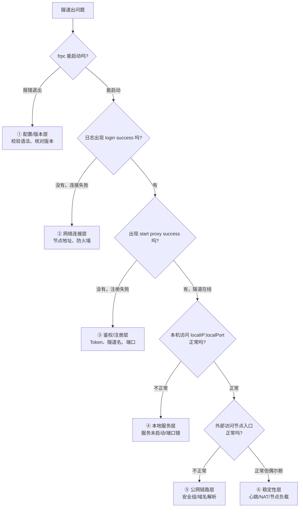
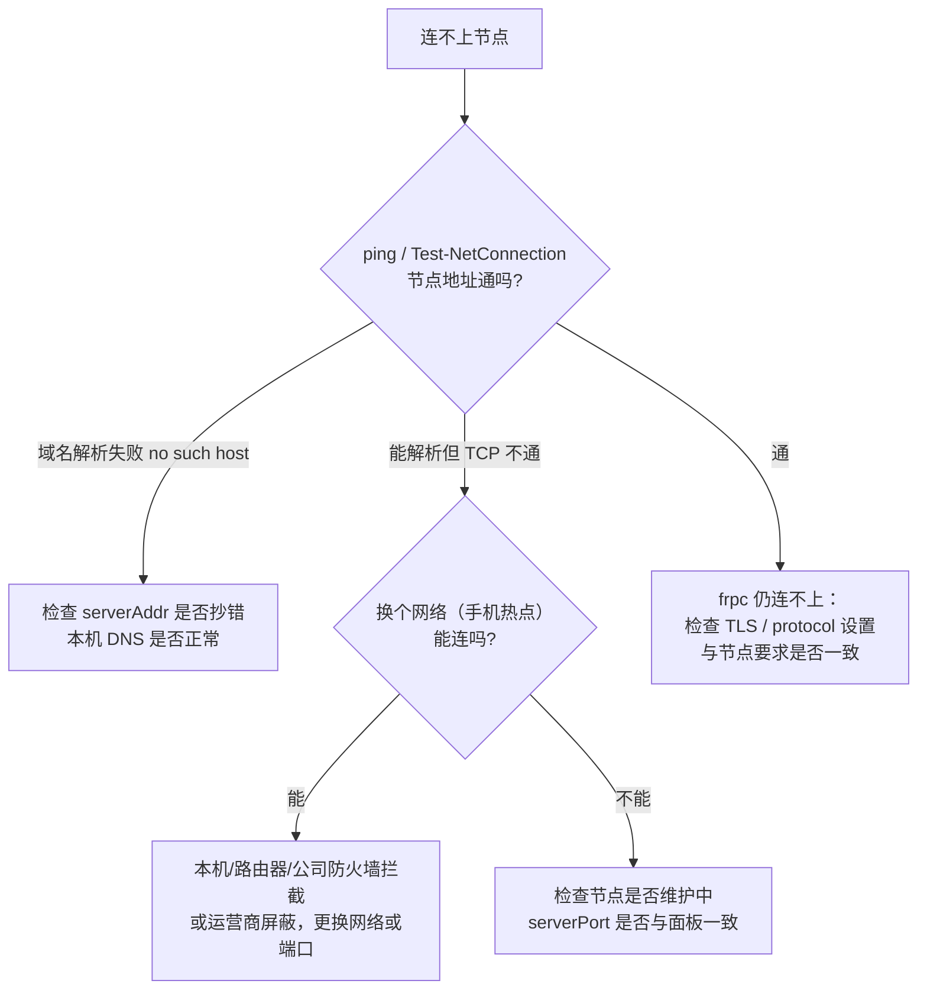
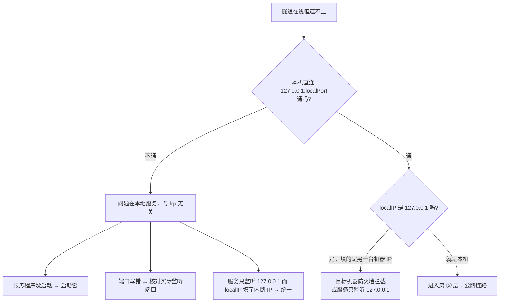

# 故障排查

隧道连不上、时通时断、启动报错时，按本页的**分层流程**从上往下查——九成问题集中在前三层（版本/Token/本地服务）。排查的核心思路是：把一条链路切成几段，逐段验证，先确定故障在哪一层，再对症下药。

## 排查总流程



## 第 0 步：先拿到日志

没有日志等于盲猜。两种方式获取：

- **直接看控制台**：命令行前台运行 `frpc -c ./frpc.toml`，日志直接打印在屏幕上（截图/复制最方便）。
- **写文件 + 开 debug**：在 `frpc.toml` 中临时加：

```toml
log.to = "./frpc.log"
log.level = "debug"   # 排查完改回 info，debug 日志量很大
log.maxDays = 3
```

关键日志标志（正常时应依次出现）：

```text
login to server success        # 已成功登录节点
start proxy success            # 每条隧道注册成功
```

哪一步之后没出现对应的标志，故障就停在哪一层。

## ① 配置 / 版本层：frpc 启动就报错

| 现象 / 日志关键字 | 原因 | 解决 |
| --- | --- | --- |
| `parse error` / `unmarshal` | TOML/INI 语法错误：引号、等号、表段写错 | 执行 `frpc verify -c frpc.toml` 校验；对照[配置文件说明](./config-file)逐行检查 |
| `unknown field` / 不识别的字段 | frpc 版本比节点旧 | 升级 frpc，与节点主版本保持一致（如都为 v0.61.x） |
| `no such file or directory` | 配置路径写错 | 用绝对路径：`frpc -c /etc/frp/frpc.toml`；Windows 用 `.\frpc.toml` |
| Windows 双击一闪而过 | 双击不是正确的启动方式 | 在 cmd / PowerShell 中执行 `frpc.exe -c .\frpc.toml`，才能看到报错 |
| INI/TOML 混用报错 | 一个文件里两种格式 | 保持单种格式；v0.52+ 用 TOML |

## ② 网络连接层：连不上节点

标志：迟迟不出现 `login to server success`，日志报超时/拒绝。



| 日志关键字 | 含义 | 处理 |
| --- | --- | --- |
| `dial tcp: i/o timeout` | 网络不通或被丢弃 | 防火墙/安全组/运营商拦截；换网络测试 |
| `connection refused` | 地址能到，但端口没服务 | `serverPort` 填错，或节点维护中 |
| `no such host` | 域名解析失败 | 核对 `serverAddr`；检查本机 DNS |
| `tls: ...` 握手错误 | TLS 设置与节点不匹配 | 按节点要求开启/关闭 `transport.tls.enable` |
| `EOF` / `connection reset` | 连上即被断开 | 多为版本不匹配或 IP 被风控；升级版本后重试 |

## ③ 鉴权 / 注册层：登录成功但隧道起不来

标志：有 `login to server success`，但没有 `start proxy success`。

| 日志关键字 | 原因 | 解决 |
| --- | --- | --- |
| `authorization failed` / `token ... doesn't match` | FRP Token 错误 | 重新复制面板 Token 到 `[auth].token`（注意首尾空格） |
| `proxy ... already exists` / 名称重复 | 隧道名冲突：同名隧道在别处在线，或删除未干净 | 停止其他 frpc；在面板删除残留同名隧道后重建 |
| `port not allowed` / `port unavailable` / 端口不可用 | `remotePort` 与面板分配不一致，或端口被占 | 以面板分配端口为准，不能自行填写 |
| `proxy ... not found` / 隧道不存在 | frpc 里有隧道，但面板上没创建 | 先在面板创建隧道，再启动 frpc |
| `custom domain ... already in use` | 域名被其他隧道/账号绑定 | 换域名或解绑旧隧道 |
| `user ... not found` / 用户信息错误 | `user` 字段不符要求 | 按面板生成的配置填写（通常填 FRP Token） |

::: warning ⚠️ 面板与本地两边必须一致
Token、隧道 `name`、`type`、`remotePort` / `customDomains` 任何一项对不上都会注册失败。最稳妥的做法是**直接用面板生成的整段配置**，不要手工改关键字段。
:::

## ④ 本地服务层：隧道在线但访问报错

隧道显示在线，外部却连不上时，**先在本机自测服务本身**——这是最常被忽略的一步：

```bash
# 在运行 frpc 的这台机器上直接访问本地服务
# Windows / Linux / macOS 通用思路：
telnet 127.0.0.1 8080          # 端口通：黑屏无报错；不通：connection refused
curl http://127.0.0.1:8080     # HTTP 服务直接看响应
```



查看端口实际监听情况：

| 系统 | 命令 |
| --- | --- |
| Windows | `netstat -ano \| findstr :8080`（再用 `tasklist \| findstr PID` 查进程） |
| Linux | `ss -lntp`（TCP）/ `ss -lnup`（UDP） |
| macOS | `lsof -nP -iTCP:8080 -sTCP:LISTEN` |

正常应看到服务监听在 `0.0.0.0:端口` 或 `127.0.0.1:端口`：

- 只有 `127.0.0.1:端口`：仅本机能连，frpc 填局域网 IP 转发另一台机器时会失败，需让服务监听 `0.0.0.0`；
- 完全查不到：服务根本没起来。

## ⑤ 公网链路层：本机能通，外部不通

| 检查点 | 方法 |
| --- | --- |
| 访问地址是否正确 | tcp/udp：`节点IP:面板分配的remotePort`，不是自己的本地端口；http/https：用域名且不带远程端口 |
| 节点防火墙/安全组 | LingYunFrp 节点端口由平台统一放通；若自建/受限节点，确认远程端口在安全组放行 |
| 本机系统防火墙 | frpc 主动外连一般无需入站规则；但转发局域网另一台机器时，那台机器要放行 frpc 所在 IP |
| 域名解析（http/https） | `nslookup 你的域名` 结果必须是节点 IP；未生效/解析错会 404 或连到默认页，见[域名解析](../scenarios/website-deploy/dns-resolve) |
| 访问者本地网络 | 公司/校园网可能封高位端口，换手机热点验证 |

## ⑥ 稳定性层：时通时断、随机掉线

| 现象 | 典型原因 | 处理 |
| --- | --- | --- |
| 用一段时间就断，过会儿自动恢复 | 家用路由器 NAT 会话老化，空闲连接被回收 | 调小 `heartbeatInterval`（如 20）；确认 `loginFailExit = false` |
| 晚高峰必卡/掉线 | 节点过载或线路拥塞 | 换负载更低的节点，见[节点线路选型](./node-select) |
| frpc 显示在线但完全不通 | 长连接僵死未触发重连 | 调小 `heartbeatTimeout`；更新到稳定版 frpc；配置[开机自启](../advanced/auto-start)自动恢复 |
| 有规律地断（如每 24 小时） | 运营商/路由器定时重拨，公网 IP 变化 | 属正常现象，靠自动重连恢复；必要时联系运营商 |
| CPU 占用高/速度上不去 | 开了压缩但流量已是压缩数据（游戏/视频） | 关闭 `useCompression` 实测对比 |
| 速度被限制在某个值 | 命中隧道/IP 限速 | 检查 `bandwidthLimit` 与面板 `ipLimitIn/Out` |

## 按隧道类型专项排查

### tcp / udp

- **udp 隧道「时灵时不灵」**：UDP 是无连接的，确认游戏客户端填的地址端口无误；部分游戏还需要额外的 TCP 隧道（建两条）。
- **远程桌面/数据库连不上**：先在本机用对应客户端连 `127.0.0.1:localPort` 验证服务，再查外部。
- **能连但马上断开**：检查是否有安全软件拦截 frpc 进程流量。

### http / https

| 现象 | 原因 / 处理 |
| --- | --- |
| 域名访问到节点默认页/404 | 域名未解析到该节点，或 `customDomains` 没填这个域名 |
| 502 / Bad Gateway | 节点能到 frpc，但 frpc 连不上本地 Web 服务 → 回到第 ④ 层 |
| 其他域名也能打开我的站 | Host 头问题；检查是否多个隧道绑了同域名 |
| HTTPS 证书报错 | 证书与域名不匹配或过期，见 [SSL 证书](../scenarios/website-deploy/ssl-cert) |

### stcp / xtcp

| 现象 | 原因 / 处理 |
| --- | --- |
| 访问者一直连不上 | 双方 `secretKey` 必须完全一致；`serverName` 必须等于暴露方隧道 `name` |
| 暴露方不在线时访问 | 必须双方 frpc **同时在线**才能建立连接 |
| xtcp 打洞失败 | NAT 类型不支持（对称型 NAT）。换 stcp 保证可用 |
| 访问者 bindPort 占用 | 改一个没被占用的本地端口 |

## 常用命令速查

| 目的 | Windows (PowerShell) | Linux / macOS |
| --- | --- | --- |
| 测 ICMP 延迟 | `ping 节点域名` | `ping -c 20 节点域名` |
| 测 TCP 端口连通 | `Test-NetConnection 节点域名 -Port 7000` | `nc -vz 节点域名 7000` |
| 查 DNS 解析 | `nslookup 域名` | `dig 域名` 或 `nslookup 域名` |
| 查端口监听 | `netstat -ano \| findstr :端口` | `ss -lntp` |
| 路由跟踪 | `tracert 节点域名` | `mtr -rwzc 50 节点域名`（或 `traceroute`） |
| HTTP 验证 | `curl http://127.0.0.1:端口` | 同左 |

::: tip 💡 二分法最快
准备两个网络（家里宽带 + 手机热点）、两台机器（本机 + 局域网另一台），通过「换一边测试」快速判断问题在访问者侧、节点侧还是服务侧，比逐行看日志效率高。
:::

## 三条必须先确认的铁律

无论什么现象，先确认这三条，能排掉大部分问题：

1. **版本一致**：frpc 与节点 frp 主版本号一致；
2. **凭证与命名一致**：Token 正确，隧道名在账号下唯一且与面板一致；
3. **本地服务在监听**：本机服务已在 `localIP:localPort` 上正常监听并可本机直连。

## 仍然无法解决

走完以上流程仍未解决，带着下面的信息再去[常见问题](../faq/)查找或反馈，能大幅缩短沟通时间：

- [ ] frpc 完整版本号（`frpc -v`）与节点要求版本
- [ ] 隧道类型，以及面板隧道配置截图（Token 可打码）
- [ ] 完整 frpc 启动日志（debug 级别，从启动到报错）
- [ ] 本机直连 `127.0.0.1:localPort` 的结果
- [ ] `Test-NetConnection` / `nc` 测节点端口的结果
- [ ] 现象是「完全不通」还是「时通时断」，从什么时候开始
