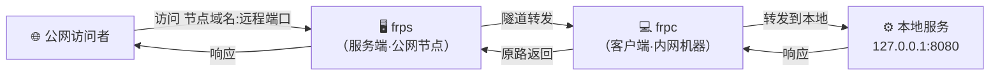
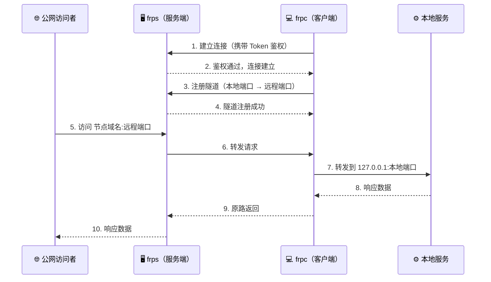
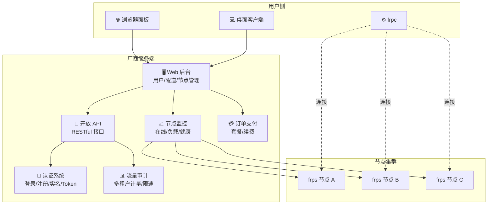
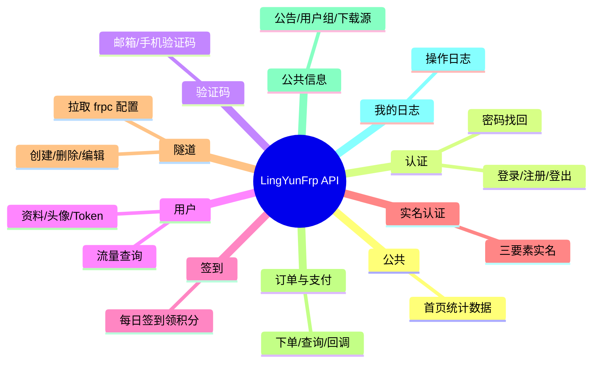
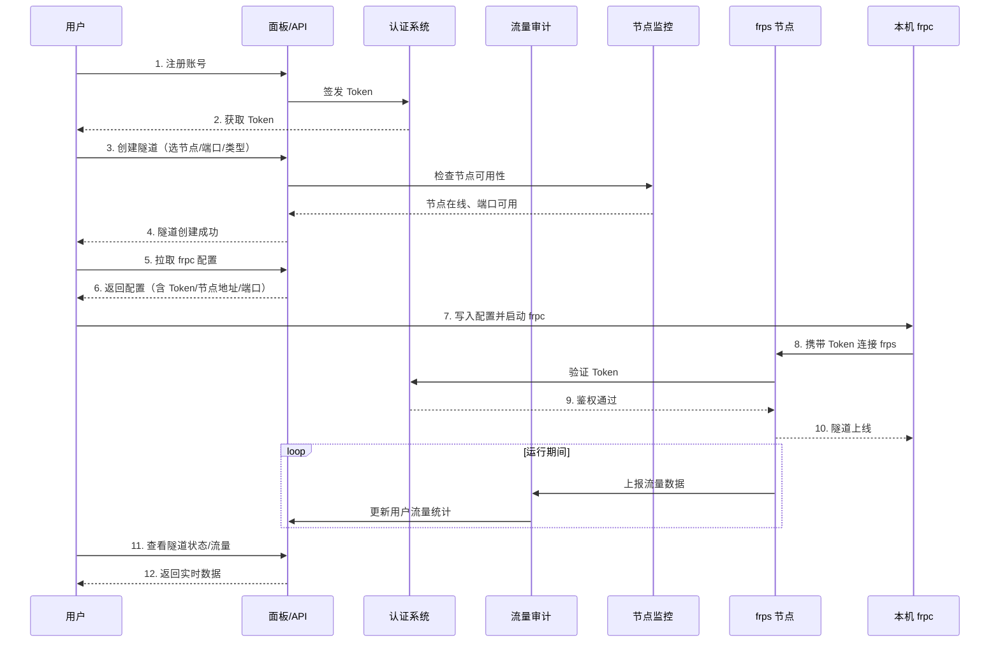

# 快速开始

首先，欢迎您使用 LingYunFrp
其次，作为frp工具，将从这篇文档开始将为您详细介绍LingYunFrp的安装、配置、使用。

市面上所有你见到的frp项目都是通过frp+多租客流量控制+web图形化界面来管理和监控隧道的。本质是是对frps和frpc的封装。因此在你会使用任何一款frp项目时，并不需要再去学习其他的frp项目。但更重要的是会解决在使用时所出现的问题。

## 开始前的准备

- 📌 一个可以正常联网的电脑或服务器
- 📌 明确自身需求并可以根据需求自主选择隧道
- 📌 明确端口暴露的后果

## 什么是frps/frpc

frp 分为服务端 **frps** 和客户端 **frpc**。frps 运行在有公网 IP 的节点上，frpc 运行在你内网的机器上。两者建立隧道后，公网用户就能通过 frps 访问到你内网的服务。

整个连接建立的过程如下：

## 我们都做了什么

原生的 frp 只是一个命令行工具：你手写配置、手动启动、看不到面板。FRP 厂商在 frp 之上加了一整套 Web 服务，让普通用户也能轻松管理隧道。

厂商在原生 frp 基础上增加了以下核心能力：

| 能力 | 说明 |
| --- | --- |
| **Web 面板** | 图形化创建/编辑/删除隧道，无需手写配置文件 |
| **多租户隔离** | 每个用户有自己的 Token、隧道配额、流量配额，互不干扰 |
| **流量计量与限速** | 按用户/隧道统计上下行流量，按用户组限制带宽 |
| **节点管理** | 统一监控多个 frps 节点的在线状态、负载、可用端口 |
| **认证体系** | 注册/登录/邮箱验证/实名认证/Token 签发 |
| **开放 API** | RESTful 接口，支持程序化创建隧道、查询状态、拉取配置 |
| **订单与支付** | 套餐购买、流量充值、到期续费 |

以 LingYunFrp 为例，开放 API 覆盖以下模块：

API 的完整文档见 [API 文档](/develop/api)，可通过侧边栏按模块浏览。

用户使用 LingYunFrp 的完整流程如下：

## 三种启动方式

| 方式 | 适用场景 |
| --- | --- |
| [网页启动隧道](./web-launch) | 在面板上创建隧道，本机仍需连接 frpc / 客户端 |
| [客户端启动隧道](./client-launch) | 桌面端下载客户端，图形界面直接管理 |
| [frpc 服务启动](./service-launch) | Linux 服务器、无图形界面，安装 frpc 常驻 |

## 阅读顺序

- 第一次用：[网页启动隧道](./web-launch) → [客户端启动隧道](./client-launch)
- 需要手写配置：[配置文件说明](../parameters/config-file)
- 拿不准名词：[术语对照表](../appendix/glossary)
