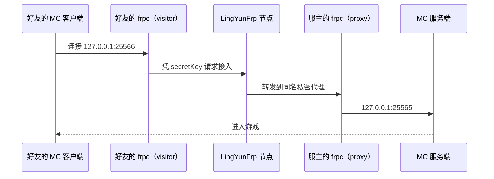

# Minecraft 开服

以最常见的 Minecraft 为例，覆盖 **Java 版**（TCP 25565）和**基岩版**（UDP 19132），从起服务到好友进服的完整流程。

## 先确认版本

| 版本 | 好友用什么连 | 默认端口 | 隧道协议 |
| --- | --- | --- | --- |
| Java 版（电脑端） | Java 版客户端 | 25565（TCP） | `tcp` |
| 基岩版（Win10/手机/主机） | 基岩版客户端 | 19132（UDP） | `udp` |

两个版本**不互通**，服务端和客户端必须是同一大类。下面先以 Java 版为例，基岩版差异在最后单独说明。

## 第一步：准备 Java 运行环境

Minecraft 服务端是一个 jar 文件，必须先装 Java。Java 版本要和服务端版本对应：

- Minecraft 1.20.5 及更新版本：**Java 21**
- 1.17 ~ 1.20.4：**Java 17**
- 更老版本：Java 8/16（不建议再开新服）

下载建议使用 **Eclipse Temurin（Adoptium）** 的免费 OpenJDK 发行版，安装后用下面命令确认：

```bash
java -version
```

- Windows：下载 .msi 安装包，安装时勾选「设置 JAVA_HOME」和「Add to PATH」；
- macOS：下载 .pkg 安装，或用 Homebrew：`brew install --cask temurin@21`；
- Linux（Ubuntu/Debian 示例）：

  ```bash
  sudo apt update && sudo apt install -y openjdk-21-jre-headless
  ```

## 第二步：启动原版服务端

### Windows

1. 新建一个**纯英文路径**文件夹，如 `D:\mc-server`（不要放桌面、不要带中文和空格，避免后续插件路径问题）；
2. 从 Minecraft 官网下载官方服务端 `server.jar`（或先用它做测试），放入该文件夹；
3. 首次启动需要同意协议：用记事本新建文件 `eula.txt`，写入：

   ```properties
   eula=true
   ```

4. 在文件夹里新建 `start.bat`，内容如下（`-Xmx` 是给服务端的最大内存，4G 适合 5 人左右原版/轻量模组，按机器内存调整）：

   ```bat
   @echo off
   java -Xms1G -Xmx4G -jar server.jar nogui
   pause
   ```

5. 双击 `start.bat`，出现 `Done` 字样即启动成功，默认监听 `25565`。


### macOS

1. 新建 `~/mc-server` 文件夹，放入 `server.jar`，写入 `eula.txt`（内容同上）；
2. 在该目录用「终端」执行：

   ```bash
   java -Xms1G -Xmx4G -jar server.jar nogui
   ```

3. 看到 `Done` 即成功。停止服务器在终端输入 `stop` 并回车（**不要直接关窗口**，强退可能丢存档）。

### Linux

命令与 macOS 相同。长期运行建议放进 screen/tmux，或直接用[可视化面板](./panels)管理：

```bash
mkdir -p ~/mc-server && cd ~/mc-server
# 放入 server.jar、写好 eula.txt
java -Xms1G -Xmx4G -jar server.jar nogui
```

### 核心配置 server.properties

首次启动后目录下生成 `server.properties`，常改的几项：

| 配置项 | 含义 | 建议 |
| --- | --- | --- |
| `server-port=25565` | 监听端口，即隧道的 `localPort` | 保持默认即可 |
| `online-mode=true` | 正版验证 | 朋友都是正版就保持 `true`，防止盗版号乱入 |
| `white-list=false` | 白名单 | 公开端口但只想让朋友进时改 `true`，再用 `whitelist add 玩家名` |
| `max-players=20` | 最大人数 | 按机器性能和上行带宽设置 |
| `view-distance=10` | 视距 | 卡顿先调小它，比限制人数更省资源 |

修改后执行 `stop` 再重新启动才会生效。

## 第三步：在 LingYunFrp 面板创建隧道

创建一条 `tcp` 隧道，本地端口填服务端端口：

| 字段 | 填写 |
| --- | --- |
| 隧道类型 | tcp（Java 版） |
| 本地地址 localIP | `127.0.0.1`（服务端和 frpc 在同一台机器时） |
| 本地端口 localPort | `25565` |
| 远程端口 | 面板分配，如 `31234` |


frpc 配置方式创建的等效写法：

```toml
[[proxies]]
name = "mc-java"
type = "tcp"
localIP = "127.0.0.1"
localPort = 25565
remotePort = 31234   # 以面板实际分配为准
```

启动 frpc 或图形客户端，日志出现 `[mc-java] start proxy success` 即可（查看方式见[日志查看](../../advanced/log-view)）。

## 第四步：好友进服

好友打开 Minecraft → 多人游戏 → 直接连接，服务器地址填：

```text
节点域名或IP:远程端口
```

例如 `node.example.com:31234`。**不是**填你家的 IP，也**不是**填 25565。


## stcp 私密联机（仅好友可连）

不想让任何陌生人扫到端口时，用 `stcp`。注意角色分工：

- **服主（开服的人）**：frpc 上配置 `[[proxies]]`，把 MC 服务端注册为私密代理；
- **好友（玩的人）**：各自的电脑上也运行 frpc，配置 `[[visitors]]`，凭相同的 `secretKey` 接入，然后连本机端口。



服主的 `frpc.toml`：

```toml
[[proxies]]
name = "secret_mc"
type = "stcp"
secretKey = "换成只有好友知道的强密码"
localIP = "127.0.0.1"
localPort = 25565
```

好友的 `frpc.toml`（serverAddr、token 等公共部分照填，只需要这一段 visitor）：

```toml
[[visitors]]
name = "secret_mc_visitor"
type = "stcp"
serverName = "secret_mc"             # 必须和服主代理的 name 完全一致
secretKey = "换成只有好友知道的强密码" # 必须与服主完全一致
bindAddr = "127.0.0.1"
bindPort = 25566                      # 好友本机的监听端口，可自行修改
```

好友启动自己的 frpc 后，在 MC 里连接 `127.0.0.1:25566` 即可。

::: tip 服主和好友是同一个人怎么办？
你自己在服主电脑上玩，直接连 `127.0.0.1:25565` 即可，不需要 visitor，延迟也最低。
:::

## 基岩版（Bedrock）差异

1. 服务端使用 Mojang 官方提供的 **Bedrock Dedicated Server（BDS）**，只有 Windows 和 Linux 版本，没有 macOS 版；
2. 隧道类型选 **udp**，本地端口 `19132`：

   ```toml
   [[proxies]]
   name = "mc-bedrock"
   type = "udp"
   localIP = "127.0.0.1"
   localPort = 19132
   remotePort = 31235
   ```

3. 好友在基岩版「服务器」里填节点地址和远程端口；
4. BDS 的配置文件是 `server.properties`，端口项为 `server-port=19132`（IPv4）和 `server-portv6=19133`，隧道只需映射 IPv4 的 19132。

## 模组服 / 插件服

| 服务端核心 | 适合 | 说明 |
| --- | --- | --- |
| Vanilla / 官方 jar | 原版 | 最省资源 |
| Paper / Purpur | 插件服（ Bukkit 插件） | 性能优化好、插件生态大，新手首选 |
| Fabric / Forge / NeoForge | 模组服 | 服主和好友必须装**同一套模组**，启动内存按模组数量增加 |
| 整合包服务端 | CurseForge/Modrinth 整合包 | 下载整合包时选 Server Files，别下成客户端 |

无论哪种核心，穿透部分完全相同：只认最终的监听端口（默认都是 25565）。

## 常见问题

| 现象 | 排查方向 |
| --- | --- |
| 好友提示「io.netty 连接超时」 | frpc 不在线 / 远程端口填错 / 隧道类型错（基岩版用了 tcp） |
| 好友能看到服务器信号但进不去 | 服务端未完成启动、`server-port` 与 `localPort` 不一致、Windows 防火墙拦截 |
| 提示「版本不匹配」 | 双方 MC 大版本不一致（如 1.21 连 1.20） |
| 进去后卡顿、方块回弹 | 上行带宽不足或机器性能不够，先调小 `view-distance`，见[性能调优](../../advanced/performance) |
| stcp 好友一直连接中 | 双方 `secretKey` 或 `serverName` 不一致；好友的 frpc 未登录同一节点 |
