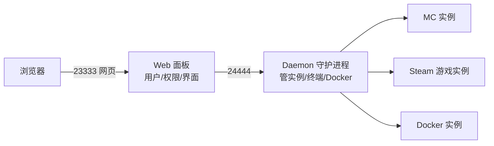
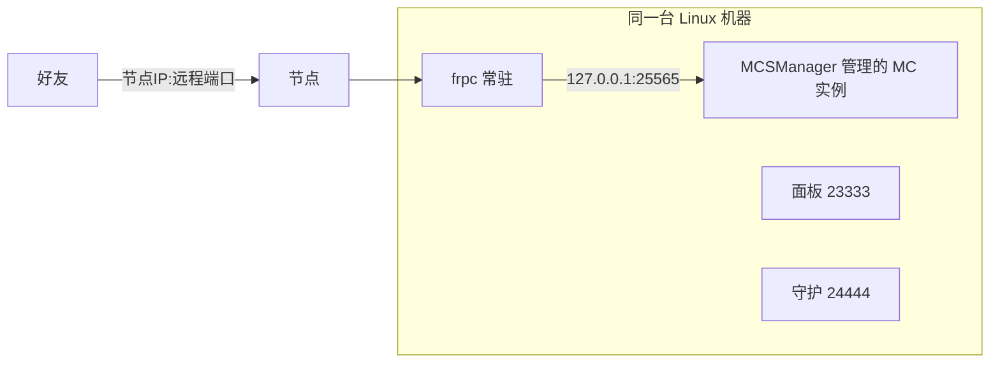

# Linux 可视化面板

长期开服（尤其是多台、多个游戏服务器）时，纯命令行管理存档、重启、更新很繁琐。可视化面板提供网页终端、文件管理、计划任务、多用户权限，手机浏览器也能管服。

## 选型对比

| 面板 | 定位 | 擅长 | 成本 / 限制 | 推荐人群 |
| --- | --- | --- | --- | --- |
| **MCSManager** | 游戏服务器管理面板 | Minecraft（Java/基岩）与 Steam 游戏（幻兽帕鲁、CS2、泰拉瑞亚等），应用市场一键部署，支持 Docker | 开源免费，仅需 Node.js | **首推**，国内 MC/帕鲁社区使用广泛，文档中文齐全 |
| **Pterodactyl（翼龙面板）** | 游戏服务器管理面板 | 通过 Eggs 支持上百种游戏，多节点、多租户、计费生态完善 | 开源免费；面板依赖 PHP 环境，节点依赖 Docker，安装链路较长 | 有运维基础、要做多机/多人商业出租 |
| **1Panel** | 通用 Linux 服务器面板 | 网站、数据库、Docker、应用商店、防火墙一体 | 开源免费 | 既要开服（用 Docker 跑镜像）又要[建网站](../website-deploy/one-click)，想一个面板全包 |
| **CasaOS** | 家庭服务器应用商店 | 界面最简单，NAS/家庭小主机上点点鼠标装应用 | 开源免费 | 放家里的小主机，以应用/影音/NAS 为主、游戏为辅 |
| **LinuxGSM** | 命令行管理脚本（非图形） | 一条命令安装/更新/备份上百种游戏服 | 开源免费 | 不用图形界面、追求轻量的熟手 |
| **Amp（CubeCoders）** | 跨平台商业游戏面板 | 支持 Windows/macOS/Linux，游戏支持面广 | 付费授权（按实例数） | 想在 Windows/macOS 上也用统一 GUI 管理的用户 |

::: tip 怎么选
- 只开 MC / 帕鲁，想最快上手 → **MCSManager**；
- 一台机器又开服又建站 → **1Panel**；
- 规划做多节点、拉朋友合租 → **Pterodactyl**；
- Windows 上想要图形化管服 → 游戏自带控制台或 **Amp**（Linux 面板大多不为 Windows 设计；MCSManager 提供 Windows 版）。
:::

## 推荐方案：MCSManager

以下信息依据其官方文档（[docs.mcsmanager.com](https://docs.mcsmanager.com/)）。

架构上分两个服务，二者缺一不可：



### 安装（Linux 一键脚本）

官方脚本需要 root 权限，支持主流 x86_64/ARM 的 Ubuntu/Debian/CentOS/Arch：

```bash
sudo su -c "wget -qO- https://script.mcsmanager.com/setup.sh | bash"
```

安装后启动并设置开机自启：

```bash
systemctl enable --now mcsm-daemon.service
systemctl enable --now mcsm-web.service
```

浏览器访问 `http://服务器IP:23333`，首次进入按引导创建管理员账号，并确认本机守护进程已自动接入。


### 创建游戏实例

1. 进入「实例」→「新建实例」，选择游戏类型（Minecraft 或 Steam 游戏服务器）；
2. MC 可直接在应用市场选择核心（Paper、Fabric 等）一键安装；
3. Steam 游戏按官方文档通过 **SteamCMD** 安装：把安装/更新命令填入实例的「更新命令」，应用市场里也有幻兽帕鲁、CS2 等现成模板；
4. 在实例控制台点「开启」，网页终端等价于游戏自带控制台，可直接发指令。


### Windows / Docker 方式

- Windows：官方 Release 提供免安装 ZIP（仅支持 64 位 Win10/11、Server 2012+），解压运行启动脚本即可；
- Docker / 群晖等 NAS：官方提供 web + daemon 双容器的 compose 模板，daemon 容器需挂载 `/var/run/docker.sock` 才能在面板里再创建游戏容器。

### 更新与备份

- 更新游戏：实例上点「更新」（本质是重跑 SteamCMD/核心下载命令）；
- 备份：面板支持计划备份实例文件（存档目录），建议备份到另一块磁盘；
- 更新面板本身：重跑官方安装脚本即可平滑升级。

## 面板与 LingYunFrp 怎么配合

面板只负责管理游戏进程，**穿透仍然是 frpc 的事**，两者互不冲突：



要点：

1. 实例的游戏端口（如 MC 25565）照常用 tcp/udp 隧道映射，配置方法同 [Minecraft 开服](./mc)；
2. **面板端口（23333）和守护端口（24444）不要直接暴露到公网**：它们是管理入口，暴露后会被扫描爆破。要在外面管服，给 23333 建 `stcp` 隧道，或只在需要时开 VPN/SSH 隧道访问；
3. frpc 用 [Docker 部署](../../advanced/docker-deploy)或 systemd 常驻（[开机自启](../../advanced/auto-start)），与面板各自独立运行，互不依赖。

## 备选：Pterodactyl（翼龙面板）简述

- 由 **Panel**（PHP 网页端，建议配域名和 HTTPS）+ **Wings**（Go 写的节点守护，依赖 Docker）两部分组成；
- 游戏支持通过社区共享的 **Eggs** 配置获得，数量多、更新活跃；
- 安装步骤比 MCSManager 多（Web 环境、数据库、Redis、域名、Docker），适合愿意按官方文档完整走一遍的用户；
- 游戏端口在 Wings 上以 Docker 端口形式存在，frpc 的 `localIP` 填宿主机可达地址、`localPort` 填实例映射出的端口即可，原理与本页上图相同。

## 通用安全建议

- 面板管理员账号使用强密码，有两步验证就开启；
- 给朋友开子账号并按实例授权，不要共用管理员；
- 定期更新面板和游戏服务端；
- RCON、面板、SSH 等管理入口一律走 stcp/VPN，不要因为「方便」建公网 tcp。
