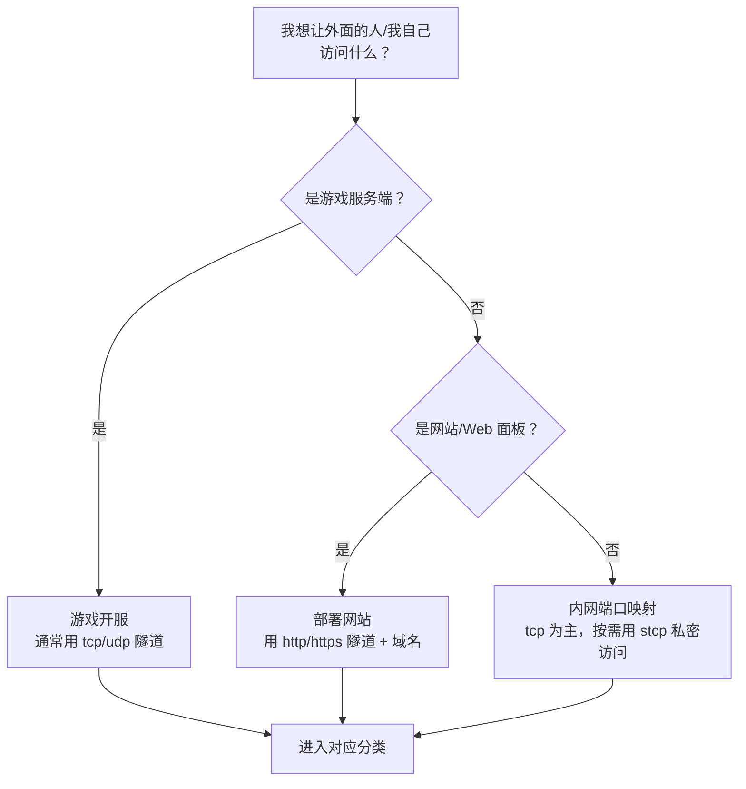

# 使用场景

本模块按真实需求分为三大类，每个类别都是独立文件夹、包含从「服务怎么起、隧道怎么建、朋友/用户怎么连」的完整链路：

| 类别 | 解决什么 | 典型需求 |
| --- | --- | --- |
| [游戏开服](./game-server/) | 把游戏服务端发布给好友联机 | Minecraft、CS2/CS:GO、幻兽帕鲁、泰拉瑞亚等 |
| [部署网站](./website-deploy/) | 把本地 Web 服务发布成公网网站 | 博客/官网、WordPress、域名、HTTPS、负载均衡 |
| [内网端口映射](./lan-access/) | 在外面访问家里/公司内网的设备和服务 | NAS、数据库、远程桌面、SSH、智能家居 |

## 先花两分钟做规划

很多问题不是隧道配置错了，而是**把服务放错了机器**。先想清楚三件事：要暴露什么、跑在哪台机器上、这台机器是否适合长期开机。

### 第一步：我要暴露的是什么？

### 第二步：服务应该跑在哪台机器上？

| 载体 | 适合什么 | 不适合什么 | 典型运行方式 |
| --- | --- | --- | --- |
| **云服务器**（你另有公网服务器时） | 其实可以直接监听公网，**不需要内网穿透** | —— | 直接部署即可 |
| **Linux 小主机 / NAS / 家庭服务器** | 长期游戏服、网站、NAS 服务（7×24、低功耗、有线网络） | 重度 3A 游戏服（显卡/单核性能不足） | frpc 常驻 + 开机自启 / Docker |
| **Windows 台式机** | 偶尔和朋友开黑、临时测试、需要 Windows 环境的 Steam 游戏服 | 长期无人值守的正式服务（要考虑电费、重启、更新弹窗） | 图形客户端或 frpc + 任务计划 |
| **macOS（Intel / Apple 芯片）** | 本地开发联调、临时演示网站 | 大多数商业游戏服务端（**很多没有 macOS 版本**） | 图形客户端 / frpc 前台运行 |
| **笔记本** | 临时、短时间使用 | 长期开服（合盖睡眠、断 WiFi、随身带走都会断服） | 用时启动即可 |

### 第三步：个人电脑（Windows / macOS）上建议与不建议

::: warning ⚠️ 在个人电脑上不建议做的事
- **不建议长期 7×24 开游戏服或网站**：个人电脑耗电高、风扇噪音大、系统自动更新会半夜重启，笔记本还会合盖睡眠；
- **不建议把数据库、管理后台等敏感服务直接用公网 tcp 裸奔**：优先用 [stcp 私密隧道](../parameters/server-params)，或限制来源、设强密码；
- **不建议在边玩游戏边开服的电脑上叠加太多人**：游戏客户端和服务端抢 CPU/内存，你和朋友都会卡；
- **不建议用家用网络做商业服务**：家庭宽带上行小（常见 30~50Mbps），很多地区家宽还禁止对外提供 Web 服务，国内建站还涉及 ICP 备案要求。
:::

::: tip ✅ 个人电脑上适合做的事
- 周末和三五个好友**临时开黑**（MC、泰拉瑞亚、幻兽帕鲁等）；
- 开发阶段把**本地网站/API 临时发给别人测试**、做支付回调联调；
- 在外面临时连回家里电脑（远程桌面、SSH），见[内网端口映射](./lan-access/)；
- 用图形客户端，开机即用、用完关掉，不折腾服务化。
:::

### 常见场景一般在什么环境下部署？

| 场景 | 最常见的部署位置 | 隧道方案 |
| --- | --- | --- |
| 两三个人的 MC 长期生存服 | 家里的旧台式机 / 小主机（Linux） | tcp，或 stcp 仅好友可连 |
| 10+ 人的模组服、CS2 社区服 | 高单核性能的台式机或租用服务器 | tcp / udp 常驻 |
| 个人博客、作品集网站 | Linux 小主机 + 面板，或云服务器 | http/https + 域名 + 证书 |
| 微信/支付回调、临时演示 | 开发用的电脑（Windows/macOS 均可） | http + 临时域名，用完即关 |
| 出门访问 NAS（照片、文件） | NAS 本体（群晖/威联通/飞牛等） | tcp 或 stcp |
| 远程维护家里路由器/电脑 | 被维护设备所在网络内常开的设备 | stcp（不建议公网裸露 3389/22） |
| 家庭数据库（Home Assistant、影音库） | NAS / 树莓派 / 小主机 | stcp 优先 |

## 通用操作链路（三大类都一样）

无论哪个场景，LingYunFrp 这一侧的步骤是固定的，区别只在隧道类型和端口：

- 隧道类型怎么选、字段什么含义：[服务端参数](../parameters/server-params)；
- frpc.toml 怎么写：[配置文件说明](../parameters/config-file)；
- 出问题怎么分层排查：[故障排查](../parameters/troubleshooting)；
- 长期在线怎么做：[进阶使用](../advanced/)。
