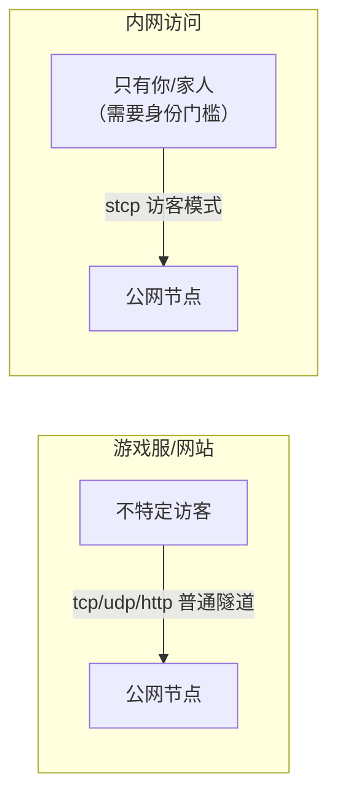
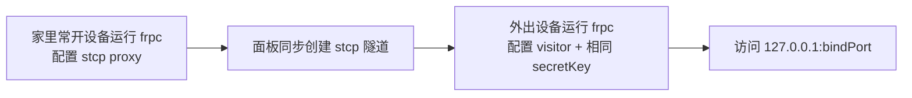

# 内网端口映射（在外面访问家里）

与前两类不同，这类需求的访客通常**只有你自己或少数家人**——人在外面，想访问家里的 NAS、电脑、数据库。因此核心诉求不是公开，而是**安全地连回家**。

## 子页面

| 页面 | 典型服务 |
| --- | --- |
| [家庭 NAS](./nas) | 群晖/威联通/飞牛 DSM 后台、照片备份、影音库（Jellyfin/Emby/Plex）、下载器 WebUI |
| [家庭数据库](./database) | MySQL、PostgreSQL、Redis、MongoDB 的远程连接 |
| [常用服务与远程管理](./services) | 远程桌面 RDP、SSH、Home Assistant、路由器/打印机/IoT 等 |

## 与游戏服/网站的关键区别



| 对比 | 游戏服/网站 | 内网访问 |
| --- | --- | --- |
| 访问者 | 不特定的朋友/访客 | 只有自己和少数人 |
| 首选隧道 | tcp/udp/http | **stcp（推荐）**，只有持密钥且运行 frpc 的设备能接入 |
| 端口扫描风险 | 知道地址可能被扫，但服务本身可公开 | 这些服务**绝不能让陌生人碰到**（远程桌面、数据库） |
| 访问者门槛 | 知道 IP:端口即可 | 需要在自己的手机/电脑上配置 visitor（手机可用对应 App 内嵌的 frp 或保持纯电脑访问） |

## 通用步骤



家中一侧（proxy）示例，以 NAS 后台 5000 端口为例：

```toml
[[proxies]]
name = "nas-web"
type = "stcp"
secretKey = "换成足够长的随机字符串"
localIP = "192.168.1.10"     # NAS 的局域网 IP（frpc 跑在别的设备上时填 NAS IP）
localPort = 5000
```

外出电脑（visitor）：

```toml
[[visitors]]
name = "nas-web-visitor"
type = "stcp"
serverName = "nas-web"
secretKey = "换成足够长的随机字符串"
bindAddr = "127.0.0.1"
bindPort = 5000
```

访问者启动 frpc 后，浏览器打开 `http://127.0.0.1:5000` 即等于访问家里 NAS。

::: tip localIP 怎么填
- frpc 与目标服务在**同一台机器**（frpc 装在 NAS 上）→ `127.0.0.1`；
- frpc 跑在家里另一台常开设备，目标是局域网内的 NAS/路由器 → 填目标设备的**局域网 IP**（如 `192.168.1.10`），并确认两台设备网络互通。
:::

## 必须遵守的安全原则

| 原则 | 说明 |
| --- | --- |
| 管理端口不上公网 | 3389（远程桌面）、22（SSH）、3306/6379（数据库）、631（打印）、路由器后台，**不要用普通 tcp 暴露** |
| secretKey 用强随机串 | stcp 的唯一凭据，建议 20 位以上随机字符，每类服务可共用也可分开 |
| 服务自身也要有密码 | stcp 是第一道门，NAS 账号、数据库密码、系统密码是第二道门，启用双重验证更佳 |
| 及时更新固件/系统 | NAS、路由器是勒索软件重点目标，开启自动更新或定期检查 |
| 不用时可禁用 | 长期出差回来后，临时 visitor 配置可停用 |

## 用什么设备跑家里的 frpc？

| 设备 | 建议 |
| --- | --- |
| NAS 本体（支持 Docker/套件） | 最方便，用 [Docker 部署](../../advanced/docker-deploy) 跑 frpc，随 NAS 开机 |
| 树莓派/小主机（OpenWrt 旁路由等） | 低功耗常开，适合 frpc 集中映射全家服务 |
| 常开的 Windows 台式机 | 可行但费电，见[开机自启](../../advanced/auto-start) |
| 路由器本身 | 部分路由器（iStoreOS、OpenWrt、Unraid 等）可装 frpc；注意路由器性能和刷固件风险 |

## 如果实在要用普通 tcp（不推荐用于敏感服务）

手机上没有方便的 frpc 运行环境、又想随时看 NAS 照片时，个别人会选择 tcp 隧道。若这样做：

1. 仅限 NAS 网页、影音中心这类**有完整账号体系**的服务；
2. 数据库、远程桌面、SSH 一律不允许；
3. 服务开启 HTTPS、自动封锁定、强密码；
4. 接受它会被全网扫描器持续探测的事实。
