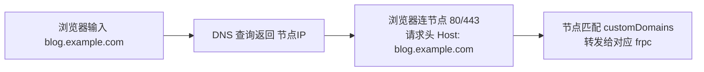
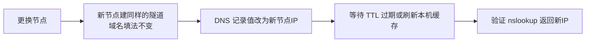

# 域名解析

`http` / `https` 隧道靠域名分流，域名必须先解析到节点 IP。本页讲清楚解析怎么配、怎么确认为什么生效了、换节点怎么办。

## 原理：节点如何找到你的隧道



两个环节缺一不可：**DNS 让浏览器找到节点，customDomains 让节点找到隧道**。只配隧道不做解析，域名不指向节点；只做解析不配域名，节点不知道转给谁。

## 配置 A 记录

登录你买域名的注册商控制台（阿里云万网、腾讯云 DNSPod、Cloudflare、Namecheap 等），在「域名解析 / DNS 管理」中添加：

| 记录类型 | 主机记录 | 记录值 | 说明 |
| --- | --- | --- | --- |
| A | `blog` | `节点IP` | 最常用。最终域名 = `blog.example.com` |
| A | `@` | `节点IP` | 主域名本身 `example.com` 也要用 |
| CNAME | `www` | `example.com` | 让 `www.example.com` 跟随主域名（二选一写法） |

- **主机记录怎么填**：要 `blog.example.com` 就填 `blog`；要 `example.com` 本身填 `@`；
- 一个主机记录只能有一个 A 记录值（除非做 DNS 轮询），不要把家里 IP 和节点 IP 同时填上；
- TTL（缓存时间）保持默认（通常 600 秒）即可；近期要频繁换节点可以调小（如 120 秒），稳定后调回。


## 常见解析组合

| 目标 | 配置 |
| --- | --- |
| 只有 `example.com` 能开 | A 记录 `@` → 节点IP，隧道 `customDomains = ["example.com"]` |
| `www.example.com` 也能开 | 再加 A 记录 `www` → 节点IP，并在 customDomains 中同时写两个 |
| 多个子域名各一个站 | `blog`、`shop`、`note` 分别加 A 记录，每个子域名一条隧道（见[一键建站多站点](./one-click)） |
| 泛域名 `*.example.com` | 添加 A 记录主机记录 `*` → 节点IP；frpc 的 customDomains 同样支持泛域名写法，省得每加一个站都改 DNS |

frpc 侧多个域名对应同一站点时：

```toml
[[proxies]]
name = "blog"
type = "http"
localPort = 80
customDomains = ["example.com", "www.example.com"]
```

## 确认解析生效

解析不是瞬间生效的，受 TTL 和本地 DNS 缓存影响，通常几分钟内：

```bash
# Windows / macOS / Linux 都可用
nslookup blog.example.com
# Linux / macOS 也可用，输出更详细
dig blog.example.com
```

返回的 Address 是**当前节点 IP** 就对了。Windows 还可以用 `ping blog.example.com` 看解析出的 IP（ping 不通没关系，节点可能禁 ICMP，IP 正确即可）。

本机缓存没刷新时：

```bash
# Windows 刷新 DNS 缓存
ipconfig /flushdns
# macOS（较新版本）
sudo dscacheutil -flushcache; sudo killall -HUP mDNSResponder
```

## 换节点后必须改解析

节点 IP 变了（切换节点、迁移），DNS 要跟着改：



忘记改解析会表现为：frpc 显示在线，但浏览器打开域名还是落到旧节点（404、默认页或打不开）。

## Cloudflare 等 CDN/代理服务注意

- 开启橙色云朵（CDN 代理）后，对外看到的是 Cloudflare 的 IP，访客→Cloudflare→节点之间多一层，免费版对**非 80/443 端口和非 HTTP 流量无效**（游戏服的自定义 UDP 端口不能走它）；
- 网站可以用 CDN，但要确保 SSL/TLS 模式与节点证书配置匹配（一般选「Full」类模式），否则容易出现重定向循环或 525/526 错误；
- 调试阶段建议先「仅 DNS（灰色云）」直连节点，确认链路没问题后再开 CDN。

## 常见问题

| 现象 | 原因 |
| --- | --- |
| 浏览器提示 DNS 错误 / 找不到域名 | 解析没生效、记录名拼错、看的域名和记录不一致 |
| 打开是节点默认页/404 | 解析对了但隧道的 `customDomains` 没写该域名，或 frpc 未在线 |
| 手机能开电脑不能开 | 电脑本地 DNS 缓存未刷新，或 hosts 文件里有旧记录 |
| 改了解析长时间不生效 | TTL 较长或旧缓存未过期；最长等待时间参考 TTL 设置 |
| 国内节点提示拦截/未备案 | 见[部署网站 · 备案说明](./#关于备案中国大陆节点) |
