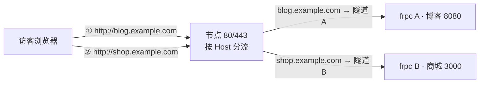
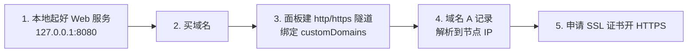

# 部署网站

把本地运行的 Web 服务（博客、官网、API、面板）通过 LingYunFrp 发布成带**自己域名**的公网网站，并配上 HTTPS。

## 子页面

| 页面 | 适合谁 |
| --- | --- |
| [一键建站](./one-click) | 想用图形界面最快上线：1Panel、宝塔面板、WordPress |
| [手动建站](./manual) | 想搞懂每一步：静态站、Nginx、本地 API 服务手动对接 |
| [域名解析](./dns-resolve) | 所有网站都要看：A 记录怎么配、多域名/泛域名怎么处理 |
| [SSL 证书](./ssl-cert) | 配 HTTPS、申请免费证书、证书放节点还是放本地 |
| [负载均衡](./load-balance) | 有多个后端、想做容灾分流时再看 |

## 网站流量与游戏的区别：节点靠域名分流

游戏服是「一个端口一个服」，而网站用 `http` / `https` 隧道时**不需要记端口**：节点统一监听 80/443，根据访客请求里的**域名**决定转发给哪条隧道。



所以 http/https 隧道的关键配置不是 `remotePort`，而是 `customDomains`：

```toml
[[proxies]]
name = "blog"
type = "http"
localIP = "127.0.0.1"
localPort = 8080
customDomains = ["blog.example.com"]
```

## 完整链路五步



其中第 4、5 步的细节：[域名解析](./dns-resolve)、[SSL 证书](./ssl-cert)。

## 没有域名能建吗？

- 做**练习、临时演示、支付/微信回调联调**：用 `tcp` 隧道映射 Web 端口，通过 `节点IP:远程端口` 访问即可，不需要域名；
- 正式对外的网站：必须有域名（http/https 隧道强制绑定域名），因为节点要靠域名区分隧道；
- 域名很便宜，常见顶级域名（.com/.cn/.top 等）按年付费，在任意正规域名注册商购买即可。

## 关于备案（中国大陆节点）

- 域名解析到**中国大陆节点**并通过 80/443 对外提供 Web 服务，按中国大陆监管要求通常需要完成 **ICP 备案**，否则可能被拦截；
- 备案由服务器/节点提供方的备案体系承接，具体能否备案、如何备案以 LingYunFrp 面板公告与注册商指引为准；
- 仅自己测试、或用 `节点IP:端口` 的 tcp 方式短期访问一般不属于公开网站，但**不要**以此规避应办的备案。

## 个人电脑适不适合建站？

| 用法 | 建议 |
| --- | --- |
| 学习、写博客时本地预览给别人看、回调联调 | 适合，Windows/macOS 直接跑，用完就关 |
| 正式个人博客/小站（访客少、可接受偶尔离线） | 可以放家里常开的小主机/NAS + frpc 自启，选海外节点可省去备案等待 |
| 公司官网、商城、不能宕机的业务 | **不建议放家庭宽带个人电脑**，上行小、IP 信誉一般、断电断网影响业务，应用云服务器 |

## 本页示例中的约定

- `example.com` 代表你的域名；
- `节点IP` 以面板节点详情为准；
- 本地服务以 `127.0.0.1:8080` 为例（一键建站工具通常是 80，Node 开发常见 3000/5173，按实际改 `localPort`）。
