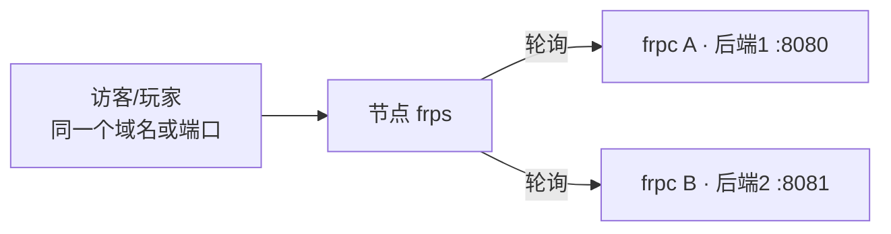

# 负载均衡与健康检查

当有**多个后端服务**（两台机器各跑一个网站/API）时，frp 可以把同一个域名/端口的请求轮询分发到不同后端；再配合健康检查，某个后端挂了自动摘除，实现容灾。

## 先判断你是否真的需要

::: warning ⚠️ 90% 的个人用户不需要本页功能
- 只有一台机器跑一个网站 → 普通 http 隧道即可，见[一键建站](./one-click)；
- frp 的负载均衡解决的是**多后端分发**，不能提升单台机器的带宽上限，也不提供真正意义上的「加速」；
- 常见的真实需求：两套环境做冗余（家里一台 + 朋友家一台）、多个同类服务分摊连接数、滚动更新时不停服。
:::

## 工作原理



多个代理加入同一个 `group`（组名相同、`groupKey` 相同），frps 会把新连接**轮询（round-robin）**分发给组内存活的代理；其中一个后端离线，流量自动落到其他后端。

frp 官方支持负载均衡的代理类型：`tcp`、`http`、`https`、`tcpmux`（udp 不支持）。

## HTTP 网站示例（最常用）

两台机器（或同机两个服务）都跑着同一个站点。要求：`groupKey`、`customDomains` 相同。

机器 A 上的 frpc.toml：

```toml
[[proxies]]
name = "web-a"
type = "http"
localIP = "127.0.0.1"
localPort = 8080
customDomains = ["app.example.com"]
loadBalancer.group = "web-cluster"
loadBalancer.groupKey = "change-this-key"
```

机器 B 上的 frpc.toml：

```toml
[[proxies]]
name = "web-b"
type = "http"
localIP = "127.0.0.1"
localPort = 8081
customDomains = ["app.example.com"]
loadBalancer.group = "web-cluster"
loadBalancer.groupKey = "change-this-key"
```

要点（依据 frp 官方文档）：

- 组名 `group` 相同才会进入同一组分发；`groupKey` 是组的鉴权密钥，**两边必须一致**，防止别人冒用你的组名；
- http 类型还要求 `customDomains`（若用了 subdomain/locations 也要）相同；
- 两个 frpc 可以在不同机器、不同网络里（两边各自安装 frpc 并登录同一节点即可），这正是冗余的意义；
- `name` 只要全局不重复即可，两边不同。

## TCP 服务示例

适用于多后端的 TCP 业务。要求 `remotePort` 也一致：

```toml
# 机器 A
[[proxies]]
name = "api-a"
type = "tcp"
localPort = 9000
remotePort = 13000
loadBalancer.group = "api-cluster"
loadBalancer.groupKey = "change-this-key"

# 机器 B
[[proxies]]
name = "api-b"
type = "tcp"
localPort = 9000
remotePort = 13000
loadBalancer.group = "api-cluster"
loadBalancer.groupKey = "change-this-key"
```

## 加上健康检查（自动摘除故障后端）

没有健康检查时，frp 只能感知「frpc 是否在线」；如果 frpc 活着但后面的 Web 服务崩了，请求仍会被分过去。健康检查会主动探测后端服务，连续失败就摘除。

### http 类型：探测状态码

```toml
[[proxies]]
name = "web-a"
type = "http"
localPort = 8080
customDomains = ["app.example.com"]
loadBalancer.group = "web-cluster"
loadBalancer.groupKey = "change-this-key"
healthCheck.type = "http"
healthCheck.path = "/health"      # 后端需返回 2xx 状态码
healthCheck.timeoutSeconds = 3
healthCheck.maxFailed = 3
healthCheck.intervalSeconds = 10
```

后端可以提供一个轻量健康接口（如 Spring Boot Actuator、Express 自定义路由、静态文件均可），返回 200：

```javascript
// Node 示例
app.get('/health', (req, res) => res.status(200).send('ok'))
```

### tcp 类型：能连上就算健康

```toml
healthCheck.type = "tcp"
healthCheck.timeoutSeconds = 3
healthCheck.maxFailed = 3
healthCheck.intervalSeconds = 10
```

| 参数 | 含义 | 常用值 |
| --- | --- | --- |
| `type` | 探测类型：`tcp`（建连成功即健康）或 `http`（返回 2xx 才健康） | 按服务类型选 |
| `path` | http 探测的路径 | 如 `/health` |
| `intervalSeconds` | 探测间隔 | 10 秒 |
| `timeoutSeconds` | 单次探测超时 | 3 秒 |
| `maxFailed` | 连续失败几次后摘除（默认 1） | 建议 3，避免网络抖动误摘 |

## 典型用法：不停机更新

1. 两台后端 A、B 同组对外；
2. 更新 B：先停 B 服务 → 健康检查失败自动摘除 → 更新并启动 B → 健康检查恢复后自动回组；
3. 同样流程更新 A。整个过程访客始终有可用后端。

## 注意事项

- 会话/状态问题：轮询意味着同一用户的不同连接可能落到不同后端。需要登录态的应用，会话应存到共享的 Redis/数据库，而不是各自内存；
- 后端内容要一致：两套服务的数据和代码版本应保持同步，否则用户会看到「刷新一下内容变了」；
- 负载均衡只在**同一节点**上的同组代理间生效，跨节点不互通；
- 游戏服（UDP）不支持该功能；朋友进不同游戏实例无法靠它合并世界；
- 健康检查不是监控告警的替代品，仍建议看[日志查看](../../advanced/log-view)确认服务状态。
