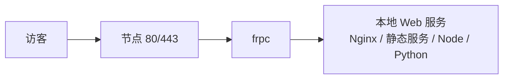

# 手动建站

不使用建站面板，自己把 Web 服务跑起来再接隧道。适合：静态博客/作品集、前后端分离项目、本地 API、开发联调。Windows、macOS、Linux 都适用。

## 典型架构



你只需要保证服务在本机某个端口（示例用 8080）能打开，frpc 负责把它接到节点。

## 类型一：纯静态网站（HTML/CSS/JS、构建后的博客）

Hexo、VitePress、Hugo、Vue/React 打包后的产物都是静态文件，任意 Web 服务器都能托管。

### 方式 A：Nginx（Linux/Windows/macOS 通用）

1. 安装：
   - Ubuntu/Debian：`sudo apt install -y nginx`
   - macOS：`brew install nginx`
   - Windows：从 [nginx.org](https://nginx.org) 下载 zip，解压即用；
2. 把静态文件放到站点目录（Linux 常见 `/var/www/blog`）；
3. 最小站点配置（Linux 通常放在 `/etc/nginx/conf.d/blog.conf`，Windows/macOS 改安装目录下的配置文件）：

   ```nginx
   server {
       listen 8080;
       server_name blog.example.com;
       root /var/www/blog;
       index index.html;

       location / {
           try_files $uri $uri/ =404;
       }
   }
   ```

4. 检查并重载：`nginx -t && nginx -s reload`（Windows 在 nginx 目录执行 `nginx -s reload`）。

### 方式 B：开发框架自带的预览服务（临时用）

```bash
# VitePress / Vite 项目，临时让局域网/隧道访问用 --host
npx vitepress build && npx vitepress preview --host 127.0.0.1 --port 8080
# Hexo
npx hexo server -p 8080
# Python 自带静态服务器（目录里有 index.html 即可）
python3 -m http.server 8080
```

::: warning ⚠️ dev server 只适合临时演示
`npm run dev`、`vite`、`python -m http.server` 这类是开发服务器，没有性能优化和安全加固。正式站点请用构建产物 + Nginx，或[一键建站](./one-click)。
:::

## 类型二：动态应用（Node / Java / Python API）

让应用监听 `127.0.0.1:8080`，前面套不套 Nginx 都行：

- **简单场景**：frpc 的 `localPort` 直接指向应用端口（如 Node 的 3000）；
- **推荐场景**：Nginx 监听 8080 反代到应用，获得静态资源缓存、gzip、请求体大小限制等能力：

  ```nginx
  server {
      listen 8080;
      server_name api.example.com;

      location / {
          proxy_pass http://127.0.0.1:3000;
          proxy_set_header Host $host;
          proxy_set_header X-Real-IP $remote_addr;
          proxy_set_header X-Forwarded-For $proxy_add_x_forwarded_for;
          proxy_set_header X-Forwarded-Proto $scheme;
      }
  }
  ```

`X-Forwarded-*` 头的用处：让你的应用拿到访客真实协议和 IP（经过多层代理后，应用直接看到的是本地连接）。需要真实访客 IP 时，frp 还支持 proxy protocol，见[服务端参数](../../parameters/server-params)。

## 配置隧道

静态站、动态应用对 frpc 而言没有区别，都是一条 http 隧道：

```toml
[[proxies]]
name = "blog"
type = "http"
localIP = "127.0.0.1"
localPort = 8080
customDomains = ["blog.example.com"]
```

在 LingYunFrp 面板图形化创建时填同样的字段即可。


## Windows / macOS 个人电脑上的注意点

| 事项 | 说明 |
| --- | --- |
| 服务监听地址 | 应用只监听 `127.0.0.1` 即可，frpc 与它在同一台机器；不需要改成 0.0.0.0 |
| 防火墙 | frpc 是**主动外连**节点，本机不需要放行任何入站端口，这也是穿透相对直接暴露的便利之处 |
| 睡眠/合盖 | macOS 合盖、Windows 睡眠都会断服务；临时用记得改电源设置为「不睡眠」，长期用请放常开设备 |
| 改代码不生效 | 静态文件改完刷新即可；改了 Nginx 配置要 `nginx -s reload`；应用代码改完要重启应用进程 |
| 启动黑窗口 | Windows 临时用保留窗口即可；长期运行见[开机自启](../../advanced/auto-start) |

## 上线前检查

1. 本机 `curl -H "Host: blog.example.com" http://127.0.0.1:8080/` 返回正常；
2. 域名已解析到节点 IP，见[域名解析](./dns-resolve)；
3. frpc 日志出现 `start proxy success`，浏览器开 `http://blog.example.com` 正常；
4. HTTPS 已配置，见[SSL 证书](./ssl-cert)；
5. 后台、数据库等敏感路径加了认证或不挂载隧道；
6. 正式服务设置了进程守护，见[进阶使用](../../advanced/)。
