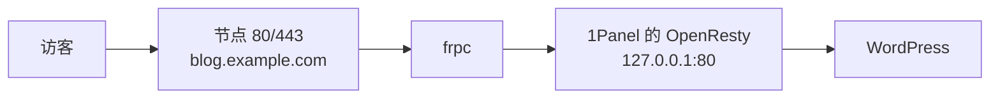

# 一键建站

不想手写 Nginx 配置、手工装 PHP/数据库时，用服务器面板「点鼠标建站」。本页介绍国内最常用的 1Panel 和宝塔面板，并以最常见的 WordPress 博客为例走通全流程。

## 工具对比

| 工具 | 特点 | 适合 |
| --- | --- | --- |
| **1Panel** | 新一代开源面板：网站、数据库、Docker、应用商店、证书申请全在网页里，界面现代 | 新手首推；又开服又建站的 Linux 小主机 |
| **宝塔面板（BT Panel）** | 老牌面板，教程插件生态最多，海外版叫 aaPanel | 习惯宝塔、跟着老教程操作的用户 |
| **CasaOS** | 更像家庭应用商店，装 Gitea、Jellyfin 等一键完成 | NAS/家里小主机，主要是自用服务而非对外正式网站 |
| **WordPress.com** | 托管平台，不用自己维护 | 不想碰服务器，但**不能**配合本地穿透 |

::: warning ⚠️ 这些面板装在哪？
1Panel/宝塔是 **Linux 服务器面板**（推荐 Ubuntu 22.04/24.04 LTS、Debian 12 等纯净系统），没有官方 macOS 版，Windows 上需在 Linux 虚拟机/ WSL2 / 云主机里运行。个人 Windows/macOS 电脑做临时站点请看[手动建站](./manual)。
:::

## 方案一：1Panel + WordPress（推荐）

整体结构：面板负责在本地 80 端口提供网站，frpc 把它通过 http 隧道发布。



### 1. 安装 1Panel

在 Linux 机器上执行官方安装脚本（具体命令以 [1Panel 官网](https://1panel.cn) 提供的为准）：

```bash
curl -sSL https://resource.fit2cloud.com/1panel/package/quick_start.sh -o quick_start.sh && sudo bash quick_start.sh
```

安装结束后终端会输出面板**访问地址、端口、用户名和初始密码**，首次登录请立刻修改。


### 2. 创建网站

1. 左侧「网站」→ 创建网站 → 类型选「**独立站点**」或直接选「WordPress」（应用商店也有一键 WP）；
2. 主域名填 `blog.example.com`；
3. 端口保持 80，其他保持默认；
4. 若选 WordPress，按提示设置数据库名、管理员账号密码。


### 3. 本机验证

在这台机器上执行，返回 WordPress 页面内容（不是连接拒绝）再继续：

```bash
curl -H "Host: blog.example.com" http://127.0.0.1/
```

### 4. 创建 frpc 隧道

在 LingYunFrp 面板创建 `http` 隧道：

| 字段 | 值 |
| --- | --- |
| 类型 | http |
| 本地端口 | `80`（1Panel 的 OpenResty） |
| 域名 customDomains | `blog.example.com` |

```toml
[[proxies]]
name = "wp-blog"
type = "http"
localIP = "127.0.0.1"
localPort = 80
customDomains = ["blog.example.com"]
```

### 5. 域名解析 + HTTPS

- 在注册商后台添加 A 记录 `blog` → 节点 IP，步骤见[域名解析](./dns-resolve)；
- 1Panel 内置「证书」功能，可用 Let's Encrypt 一键申请并自动续签；但穿透架构下证书放在哪里有讲究，先读 [SSL 证书](./ssl-cert)再操作。

### 6. 浏览器访问

解析生效后访问 `http://blog.example.com` 进入 WordPress 安装向导；后台地址通常是 `http://blog.example.com/wp-admin`。


## 方案二：宝塔面板

流程与 1Panel 几乎一致：

1. 按 [宝塔官网](https://www.bt.cn) 对应系统的安装命令装面板，登录后按推荐套件安装 **Nginx（OpenResty）+ MySQL + PHP**（WordPress 需要 PHP + MySQL，具体版本以 WP 官方当前要求为准）；
2. 「网站」→ 添加站点，域名填 `blog.example.com`，勾选创建数据库；
3. 从 [WordPress 官网](https://cn.wordpress.org) 下载压缩包，解压上传到站点根目录（或在「应用商店」找 WordPress 一键部署）；
4. frpc 隧道、域名解析、证书的做法与 1Panel 完全相同，把 `localPort` 指向宝塔 Nginx 的 80 即可。


## 方案三：CasaOS（家庭小主机/NAS 风格）

CasaOS 以 Docker 应用为核心，适合在家里的 x86/ARM 小主机上跑：

- 应用商店里可一键安装 WordPress、Gitea、Memos 等，每个应用自动获得一个本机端口（如 `127.0.0.1:8081`）；
- 给每个应用各建一条 http 隧道，`localPort` 填该应用端口，`customDomains` 填对应子域名，实现一机多站；
- 同样需要把域名解析到节点、按需配证书。

## 多站点共用一条 frpc 的写法

一条 frpc 连接可承载任意多条隧道，多个网站就写多个 `[[proxies]]`，节点按域名自动区分：

```toml
[[proxies]]
name = "blog"
type = "http"
localPort = 80
customDomains = ["blog.example.com"]

[[proxies]]
name = "memos"
type = "http"
localPort = 5230
customDomains = ["note.example.com"]
```

## 一键建站的安全底线

- 面板自身的管理入口（1Panel/宝塔的后台端口）**不要**建公网 http 隧道，需要外网管理时用 stcp（见[内网端口映射](../lan-access/)）；
- WordPress 装好后立刻删安装插件提示、改掉默认的 `admin` 用户名，保持插件/主题更新；
- 数据库只监听 127.0.0.1，绝不对外暴露 3306；
- 后台路径、登录失败限制等安全插件可以装，但不要装来路不明的破解主题/插件。
