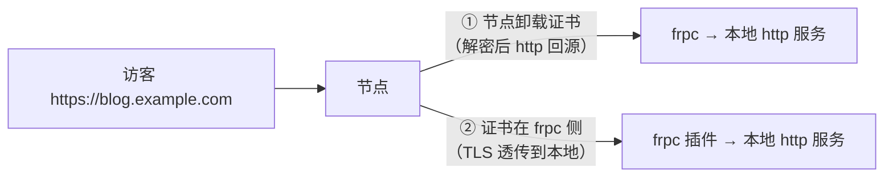

# SSL 证书（HTTPS）

给网站启用 HTTPS：浏览器显示小锁、防止传输内容被窃听篡改，也是现代浏览器对登录、支付、定位等功能的硬性要求。

## 先理解证书在链路中的位置

穿透架构中 TLS 证书有两种放置方式，决定了你怎么申请、在哪里配置：



| 方式 | 证书放在哪 | 本地服务 | 特点 |
| --- | --- | --- | --- |
| ① 节点侧卸载 | 节点 / 面板 | 只提供 http | 最省心，证书更新在平台侧；**是否支持以上传/申请证书以 LingYunFrp 面板功能为准** |
| ② frpc 侧持有 | 本机（frpc 插件加载 crt/key） | http 即可（由插件解密回源） | 证书完全自己管理，需要节点支持 `https` 类型隧道 |

::: tip 选择建议
1. 先看面板是否提供「HTTPS / 证书管理 / 申请 SSL」入口——有，优先用方式①；
2. 面板没有证书功能、但允许创建 `https` 隧道时，用方式②；
3. 还不确定就先用 http 隧道把站点跑通，再按本页加 HTTPS。
:::

## 第一步：申请免费证书（Let's Encrypt）

主流免费证书由 **Let's Encrypt** 签发，有效期 90 天，靠工具自动续签。ZeroSSL 等也是可选的免费来源。

### 方式 A：建站面板内一键申请（最简单）

1Panel、宝塔的「网站 → HTTPS/证书」里都内置了 Let's Encrypt 申请：

1. 先确保域名已解析到节点、http 站点已经能通过域名打开（见[域名解析](./dns-resolve)）；
2. 面板中选择站点 →「申请证书」，勾选域名，按提示申请；
3. 面板一般会自动配置续签计划任务。


### 方式 B：acme.sh（命令行，穿透环境推荐 DNS 验证）

申请证书需要证明域名归你所有，有两种验证方式：

| 验证方式 | 原理 | 穿透环境下 |
| --- | --- | --- |
| HTTP-01 | CA 访问 `http://域名/.well-known/...` 验证 | 要求 http 隧道已通且验证文件能被访问，链路依赖较多 |
| **DNS-01** | 在域名 DNS 中自动添加一条 TXT 记录 | **推荐**：不依赖 80 端口和回源链路，acme.sh 用注册商 API 自动完成 |

以 acme.sh DNS-01 为例（具体 API 参数以 [acme.sh 官方 wiki](https://github.com/acmesh-official/acme.sh) 对应注册商为准）：

```bash
# 安装 acme.sh
curl https://get.acme.sh | sh -s email=you@example.com

# 示例：使用域名商的 API 密钥自动添加 TXT 记录（不同商家变量名不同）
export CF_Token="你的Cloudflare_API_Token"
~/.acme.sh/acme.sh --issue --dns dns_cf -d blog.example.com

# 安装证书到指定目录（自动配置续签后的 reload 命令）
~/.acme.sh/acme.sh --install-cert -d blog.example.com \
  --key-file       /etc/frp/ssl/blog.example.com.key \
  --fullchain-file /etc/frp/ssl/blog.example.com.pem
```

## 第二步：在链路中启用

### 方式①：节点侧卸载（按面板功能配置）

在面板的证书/HTTPS 管理处上传或申请证书并绑定到对应域名，本地服务保持 http 不变。访客看到 HTTPS，节点与 frpc 之间走隧道回源。


### 方式②：frpc 的 https2http 插件

当节点支持 `https` 类型隧道时，可在本机由 frpc 加载证书：frps 把 TLS 流量透传给 frpc，frpc 用 `https2http` 插件解密后转发给本地 http 服务。

```toml
[[proxies]]
name = "blog-https"
type = "https"
customDomains = ["blog.example.com"]

[proxies.plugin]
type = "https2http"
localAddr = "127.0.0.1:80"          # 本地 http 服务地址
crtPath = "/etc/frp/ssl/blog.example.com.pem"
keyPath = "/etc/frp/ssl/blog.example.com.key"
```

说明：

- `crtPath` 使用**完整证书链**（fullchain），否则部分浏览器报证书链不完整；
- 证书文件路径要 frpc 有读取权限，续签后需重启 frpc 或使其重新加载；
- 若本地服务本身已支持 HTTPS，则对应使用 `https2https` 思路，通常无必要，优先让本地只跑 http、由一处统一卸载证书，避免双重加密和配置翻倍。

## HTTP 自动跳转 HTTPS

证书生效后，让访问 `http://blog.example.com` 的访客自动跳到 https：

- **节点侧卸载**：若面板提供「强制 HTTPS」开关，直接开启；
- **本地 Nginx 卸载/接管时**：加一个 80 跳 443 的 server 块：

  ```nginx
  server {
      listen 80;
      server_name blog.example.com;
      return 301 https://$host$request_uri;
  }
  ```

穿透链路下跳转要按「证书实际卸载的位置」配置，避免重定向循环（http 页不停地跳自己）。用了 Cloudflare 等 CDN 时，加密模式一般选 Full（不要选 Flexible），同样是为避免循环。

## 验证

- 浏览器访问 `https://blog.example.com`，地址栏有小锁、证书域名与访问域名一致；
- 用命令行查看证书与有效期：

  ```bash
  echo | openssl s_client -connect blog.example.com:443 -servername blog.example.com 2>/dev/null | openssl x509 -noout -dates -subject
  ```

- 用 [SSL Labs](https://www.ssllabs.com/ssltest/) 等工具可检查证书链和配置评级（可选）。

## 常见问题

| 现象 | 原因 / 处理 |
| --- | --- |
| 浏览器提示「证书不受信任」 | 自签证书/证书链不完整/非受信 CA；用 Let's Encrypt 并配置 fullchain |
| 证书域名不匹配 | 证书签给 `example.com`，访问的是 `blog.example.com`；签发时把所有要用的域名都带上（`-d` 可多次或用泛域名） |
| 证书过期 | Let's Encrypt 证书只有 90 天；确认续签任务（acme.sh 的 cron / 面板自动续签）正常，续签后重载对应服务 |
| 502 / 525 / 重定向循环 | 节点、CDN、本地三方的 HTTP/HTTPS 模式没对齐；先关掉 CDN 代理、统一证书卸载位置再逐个排查 |
| 申请证书失败 | DNS 还没生效、80 验证链路不通；改用 DNS-01 验证 |
